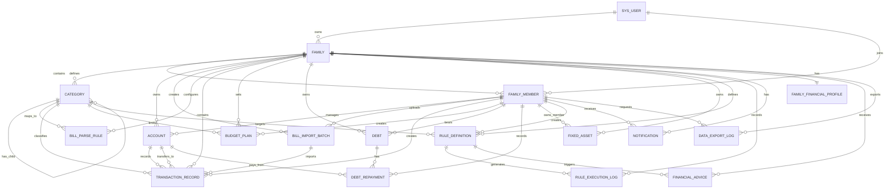

# 家庭财务管理系统 ER 图说明

这份 ER 图说明基于前面设计的数据库表结构，目标是服务两件事：

- 给你的论文“数据库设计”章节直接使用
- 给后端开发提供实体关系参考

## 1. 核心设计思路

系统采用“家庭”为核心的数据隔离模型。

- `sys_user` 表示系统登录账号
- `family` 表示家庭单元
- `family_member` 表示某个用户在某个家庭中的成员身份
- 所有核心业务数据基本都通过 `family_id` 归属于某个家庭

这样设计的好处是：

- 支持一个用户加入多个家庭
- 支持家庭内多成员共享数据
- 便于做家庭间数据隔离
- 后续权限控制更清晰

## 2. ER 图

下面是 Mermaid 版本的 ER 图代码。你可以直接在支持 Mermaid 的 Markdown 工具中预览，例如 VS Code、Typora、Obsidian 或在线 Mermaid 编辑器。

## 3. 主要实体说明

### 3.1 用户与家庭模块

#### `sys_user`

登录用户主表，用于保存系统账号信息。

主要字段：

- `id`：用户主键
- `username`：登录名
- `password_hash`：密码哈希
- `phone`：手机号
- `email`：邮箱
- `status`：账号状态

#### `family`

家庭主表，是整个系统的数据归属单位。

主要字段：

- `id`：家庭主键
- `family_name`：家庭名称
- `owner_user_id`：家庭创建者
- `invite_code`：邀请码

#### `family_member`

家庭成员关系表，用于描述“哪个用户在某个家庭中扮演什么角色”。

主要字段：

- `family_id`：所属家庭
- `user_id`：对应用户
- `role_code`：角色代码，如 `OWNER`、`ADMIN`、`MEMBER`
- `permission_json`：细粒度权限配置

### 3.2 收支与账户模块

#### `account`

账户表，用于表示现金、银行卡、信用卡、支付宝、微信等资金载体。

主要字段：

- `family_id`：所属家庭
- `owner_member_id`：账户归属成员
- `account_type`：账户类型
- `current_balance`：当前余额

#### `category`

收支分类表，支持系统预设分类和家庭自定义分类，也支持父子分类。

主要字段：

- `family_id`：所属家庭
- `parent_id`：父分类
- `category_name`：分类名称
- `category_type`：收入或支出

#### `transaction_record`

交易流水表，是系统最核心的业务表之一。

主要字段：

- `family_id`：所属家庭
- `account_id`：资金账户
- `target_account_id`：目标账户，主要用于转账
- `category_id`：交易分类
- `transaction_type`：收入、支出、转账
- `amount`：金额
- `transaction_time`：交易时间
- `merchant_name`：商户名称
- `source_platform`：来源平台，如手工录入、支付宝、微信

### 3.3 账单导入模块

#### `bill_import_batch`

账单导入批次表，用于记录一次文件导入任务的结果。

主要字段：

- `source_platform`：账单来源平台
- `original_file_name`：原始文件名
- `import_status`：导入状态
- `success_count`：成功导入条数
- `fail_count`：失败条数

#### `bill_parse_rule`

商户归类规则表，是账单“智能解析”的关键配置表。

主要字段：

- `merchant_keyword`：商户关键词
- `regex_pattern`：正则表达式
- `category_id`：归属分类
- `priority`：优先级

### 3.4 预算、债务、资产模块

#### `budget_plan`

预算计划表，用于按分类控制月度或年度支出。

主要字段：

- `family_id`：所属家庭
- `category_id`：预算分类
- `period_type`：周期类型
- `amount`：预算金额
- `alert_ratio`：预警阈值比例

#### `debt`

债务主表，用于记录信用卡账单、个人借款等。

主要字段：

- `debt_type`：债务类型
- `principal_amount`：本金
- `current_balance`：当前剩余待还金额
- `annual_rate`：年利率
- `repayment_day`：每月还款日

#### `debt_repayment`

债务还款记录表，用于记录每次具体还款。

主要字段：

- `debt_id`：所属债务
- `pay_account_id`：付款账户
- `amount`：还款总额
- `principal_paid`：归还本金
- `interest_paid`：归还利息

#### `fixed_asset`

固定资产表，用于记录房产、车辆等非流动资产。

主要字段：

- `asset_name`：资产名称
- `asset_type`：资产类型
- `purchase_amount`：购入金额
- `purchase_date`：购入日期

### 3.5 规则引擎与消息模块

#### `rule_definition`

规则定义表，用于把预算预警、债务提醒、消费异常、理财建议等规则从代码中抽离出来。

主要字段：

- `rule_type`：规则类型
- `metric_type`：检测指标
- `operator_type`：比较运算符
- `threshold_value`：阈值
- `action_type`：触发动作
- `message_template`：提醒模板

#### `rule_execution_log`

规则执行日志表，用于记录规则扫描结果，便于系统调试和论文展示。

主要字段：

- `rule_id`：规则主键
- `result_status`：是否触发
- `metric_value`：实际计算值
- `trigger_time`：触发时间

#### `notification`

消息中心表，用于保存预算预警、还款提醒、系统通知等消息。

主要字段：

- `target_member_id`：目标成员
- `source_type`：消息来源类型
- `title`：标题
- `content`：内容
- `read_status`：是否已读

### 3.6 理财建议与导出模块

#### `family_financial_profile`

家庭财务画像表，用于保存风险偏好、储蓄目标等信息，为理财建议提供输入。

#### `financial_advice`

理财建议表，用于保存系统生成的个性化建议。

#### `data_export_log`

数据导出日志表，用于记录 Excel、PDF 等导出任务。

## 4. 关键关系说明

论文里你可以重点解释下面几组关系：

### 4.1 用户、家庭、成员

- 一个用户可以创建多个家庭
- 一个家庭可以有多个成员
- 一个用户也可以加入多个家庭

因此采用：

- `sys_user` 存账号
- `family` 存家庭
- `family_member` 做多对多关系中间表

### 4.2 家庭与业务数据

为了保证不同家庭的数据隔离，交易、账户、预算、债务、规则、消息等业务表都通过 `family_id` 与家庭关联。

这也是本系统最重要的数据安全设计之一。

### 4.3 交易、账户、分类

一条交易记录至少关联一个账户，可选择关联一个分类。

- 支出：账户扣减，分类多为支出类
- 收入：账户增加，分类多为收入类
- 转账：`account_id` 与 `target_account_id` 同时参与

### 4.4 规则与消息

规则表不直接存运行结果，而是：

- `rule_definition` 存规则配置
- `rule_execution_log` 存执行记录
- `notification` 存实际发给用户的提醒

这样设计有利于系统扩展和论文中的“可配置规则引擎”描述。

## 5. 适合论文里写的总结

你可以直接参考下面这段意思：

本系统以家庭为核心数据单元，构建了用户、家庭成员、账户、交易、预算、债务、固定资产、规则引擎和消息中心等实体之间的关系模型。通过在核心业务表中引入 `family_id` 字段，实现了家庭间的数据隔离；通过 `family_member` 关系表实现了多成员协同管理；通过 `rule_definition` 与 `rule_execution_log` 的分层设计，增强了规则引擎的可配置性与可扩展性。整体数据库设计既满足了家庭财务管理系统的业务需求，也为后续的数据分析、消息提醒和理财建议功能提供了良好的数据基础。

## 6. 使用建议

如果你后面要继续做毕业设计，我建议按下面顺序使用这份 ER 图：

1. 先把 `sys_user`、`family`、`family_member`、`account`、`category`、`transaction_record` 落成实体类
2. 再补 `budget_plan`、`debt`、`rule_definition`、`notification`
3. 最后补导入、理财建议、导出等增强模块

如果你需要，我下一步可以继续直接帮你输出：

- 数据库 E-R 关系的论文版描述
- 各表字段字典说明
- 基于这套表结构生成 Spring Boot 实体类
