# 当前项目完成情况与验收说明

更新时间：2026-03-11

适用项目目录：`C:\Users\Ttop\codex_tmp_finance_verify_20260309_1`

## 1. 文档目的

这份文档用于说明当前项目已经做到什么程度、项目中每个类的大致职责、各个模块之间如何联通，以及如何对当前项目进行验收测试。

这不是开题报告中的最终成品说明，而是“当前代码仓库真实状态说明”。阅读这份文档后，你应该能回答下面几个问题：

1. 这个项目现在到底做到了什么。
2. 哪些功能已经能演示，哪些还只是数据模型或遗留代码。
3. 项目里每个类大概负责什么。
4. 如何自己启动项目并逐步验收。

## 2. 当前项目总体判断

### 2.1 一句话结论

当前项目已经形成了一个“可运行、可登录、可按家庭权限访问、可导入账单、可做预算/债务/规则评估”的后端原型系统，但还不是完整毕设成品。

### 2.2 当前已经完成的核心能力

- 用户注册、JWT 登录、获取当前登录用户信息。
- 家庭创建，创建家庭时自动把创建者写入家庭成员表并赋予 `OWNER` 角色。
- 家庭账户、收支分类、预算、交易流水、债务、通知等基础后端接口。
- 新版交易流水 `TransactionRecord` 与账户余额联动。
- 预算使用率统计、预算预警。
- 新版规则定义、手动规则评估、规则执行日志、通知生成。
- 债务还款、债务提醒检查。
- CSV 账单导入、文件级防重、流水号级防重。
- 商户关键词/正则自动分类。
- 待归类账单队列、人工归类、自动补解析规则。
- 家庭成员级别的接口访问控制。

### 2.3 当前明显还没完成的部分

- 微信小程序端未接入。
- Web 管理后台未接入。
- 固定资产、理财建议、数据导出只有实体模型，没有业务接口。
- 规则引擎还只是轻量版，不支持复杂组合条件、趋势判断、连续超支等高级规则。
- 规则评估和债务提醒还是手动触发，没有定时自动调度。
- 消息中心还是站内消息，没有微信订阅消息、短信、邮件等外部推送。
- 测试覆盖率很低。

### 2.4 当前适合用于验收的范围

适合验收的模块：

- 认证与权限
- 家庭与成员主账号初始化
- 账户与分类
- 预算
- 新版交易流水
- 债务与还款
- 通知
- 账单导入与待归类处理
- 新版规则定义与规则评估

不适合作为当前验收重点的模块：

- 固定资产
- 家庭财务画像
- 理财建议
- 数据导出
- 前端页面
- 旧版 `Transaction / Rule` 演示链路

## 3. 项目技术栈与运行基础

### 3.1 技术栈

- Java 17
- Spring Boot 4.0.2
- Spring Data JPA
- Spring Security
- MySQL 8
- Maven
- JWT

### 3.2 关键运行文件

- 启动类：`src/main/java/com/example/finance/FinanceApplication.java`
- 配置文件：`src/main/resources/application.yml`
- 建表脚本：`sql/finance_schema.sql`
- 数据库设计文档：`docs/database/db_schema_design.md`
- ER 图文档：`docs/database/finance_er_diagram.md`

### 3.3 当前项目结构

主线包结构如下：

- `controller`：接口入口层
- `dto`：请求/响应模型
- `service`：业务逻辑层
- `security`：登录鉴权与家庭访问控制
- `repository`：数据库访问层
- `entity`：数据库实体模型
- `util`：工具类

遗留包结构如下：

- `mapper`：旧版实体转 DTO
- `ruleengine`：旧版轻量规则引擎

测试结构如下：

- `src/test/java/com/example/finance`

## 4. 当前功能模块完成情况

### 4.1 认证与权限

状态：已完成基础版本。

已实现：

- 普通用户注册
- JWT 登录
- 当前用户信息查询
- 基于家庭成员关系的读写权限控制
- 家庭主账号权限控制
- 管理员查看用户列表

限制：

- 没有刷新 token
- 没有修改密码
- 没有找回密码
- 密码仍使用 `SHA-256`，不是更稳妥的 `BCrypt`

### 4.2 家庭与成员

状态：已完成基础版本。

已实现：

- 创建家庭
- 查询当前用户可访问的家庭列表
- 查询家庭详情
- 自动创建家庭主账号成员记录

限制：

- 没有邀请加入家庭
- 没有成员列表接口
- 没有成员角色变更接口

### 4.3 账户与分类

状态：已完成基础版本。

已实现：

- 创建账户
- 查询家庭账户列表
- 创建分类
- 查询家庭分类列表

限制：

- 没有编辑、删除、启停用接口

### 4.4 预算

状态：已完成基础版本。

已实现：

- 创建预算
- 查询预算列表
- 查询预算使用情况
- 预算预警可被规则评估服务消费

限制：

- 没有编辑、删除预算
- 没有复杂统计报表

### 4.5 新版交易流水

状态：已完成基础版本。

已实现：

- 录入收入、支出、转账
- 查询交易流水列表
- 查询月度收支汇总
- 交易与账户余额联动

限制：

- 没有编辑、删除
- 没有分页、复杂筛选

### 4.6 债务管理

状态：已完成基础版本。

已实现：

- 创建债务
- 查询债务列表
- 记录还款
- 查询还款记录
- 检查到期/逾期提醒

限制：

- 没有编辑、删除债务
- 没有自动分期计划

### 4.7 通知中心

状态：已完成基础版本。

已实现：

- 查询消息
- 标记消息已读
- 同一天同源标题去重
- 按家庭成员权限过滤消息可见范围

限制：

- 只有站内消息
- 没有外部推送渠道

### 4.8 账单导入

状态：已完成当前后端最复杂的一条主线。

已实现：

- 上传 CSV 账单
- 记录导入批次
- 文件级去重
- 外部流水号级去重
- 自动匹配分类规则
- 未匹配项进入待归类队列
- 人工归类后回写交易记录分类
- 可选自动生成新的关键词解析规则
- 兼容支付宝/微信常见中文表头
- 支持 UTF-8/GBK 两种常见编码

限制：

- 当前仍以 CSV 为主
- 没有 Excel 导入
- 没有完整的平台专用复杂解析器

### 4.9 规则引擎

状态：已完成轻量版。

已实现：

- 创建规则定义
- 查询规则列表
- 手动执行规则评估
- 写入规则执行日志
- 生成规则通知
- 联动预算预警

限制：

- 只有阈值类规则
- 只支持家庭支出或分类支出
- 没有定时调度
- 没有复杂趋势规则

### 4.10 仅完成数据建模但尚未落地的模块

状态：只有实体，没有完整业务链路。

包含：

- 固定资产
- 家庭财务画像
- 理财建议
- 数据导出日志

## 5. 模块联通关系

### 5.1 当前主线调用链

#### 登录链

`AuthController -> AuthService -> SysUserRepository + PasswordHashUtil + JwtService`

#### 鉴权链

`SecurityConfig -> JwtAuthenticationFilter -> JwtService -> SysUserPrincipalService -> AuthenticatedUser`

#### 家庭权限链

`Controller -> FamilyAccessService -> CurrentUserService + FamilyMemberRepository + FamilyRepository`

#### 手工记账链

`TransactionRecordController -> TransactionRecordService -> AccountRepository + TransactionRecordRepository`

#### 预算链

`BudgetController -> BudgetService -> BudgetPlanRepository + TransactionRecordRepository`

#### 债务链

`DebtController -> DebtService -> DebtRepository + DebtRepaymentRepository + NotificationService`

#### 规则评估链

`RuleDefinitionController -> RuleEvaluationService -> BudgetService + RuleDefinitionRepository + TransactionRecordRepository + RuleExecutionLogRepository + NotificationService`

#### 账单导入链

`BillImportController -> BillImportService -> CsvParserUtil -> BillParseRuleService -> TransactionRecordService -> BillImportPendingItemService`

#### 待归类处理链

`BillImportController -> BillImportPendingItemService -> TransactionRecordRepository + BillParseRuleService`

### 5.2 当前主线实体关系

- `SysUser -> FamilyMember -> Family`
- `Family -> Category`
- `Family -> Account`
- `Family -> TransactionRecord`
- `Family -> BudgetPlan`
- `Family -> Debt`
- `Family -> BillImportBatch`
- `Family -> BillImportPendingItem`
- `Family -> RuleDefinition`
- `Family -> Notification`
- `BillImportBatch -> TransactionRecord`
- `BillImportPendingItem -> TransactionRecord`
- `RuleDefinition -> RuleExecutionLog`
- `Debt -> DebtRepayment`

### 5.3 新体系与旧体系的区别

当前项目其实有两套并行体系：

#### 新体系

以 `TransactionRecord`、`RuleDefinition` 为核心，是当前应当作为毕设主线讲解和验收的体系。

#### 旧体系

以 `Transaction`、`Rule` 为核心，是早期演示代码或兼容保留代码，只保留了非常简单的接口和逻辑，不建议继续作为主线讲解。

## 6. 类级说明

本节按包罗列当前项目中的每个类，并用简短话语说明其作用。

### 6.1 启动类

- `FinanceApplication`
  - Spring Boot 启动入口，负责启动整个后端应用。

### 6.2 controller 包

- `UserController`
  - 提供用户注册与用户列表查询接口，当前用户列表仅管理员可访问。
- `AuthController`
  - 提供登录和获取当前登录用户信息接口。
- `FamilyController`
  - 提供家庭创建、当前用户可访问家庭列表、家庭详情查询接口。
- `AccountController`
  - 提供账户创建和家庭账户列表查询接口。
- `CategoryController`
  - 提供分类创建和分类列表查询接口。
- `BudgetController`
  - 提供预算创建、预算列表和预算使用情况统计接口。
- `TransactionRecordController`
  - 提供新版交易流水创建、列表查询和月度汇总接口。
- `DebtController`
  - 提供债务创建、债务列表、还款登记、还款记录查询和提醒检查接口。
- `NotificationController`
  - 提供消息列表查询与标记已读接口。
- `BillParseRuleController`
  - 提供账单解析规则创建与规则列表查询接口。
- `BillImportController`
  - 提供账单导入、导入批次查询、待归类查询和待归类处理接口。
- `RuleDefinitionController`
  - 提供新版规则定义创建、列表查询和手动规则评估接口。
- `TransactionController`
  - 旧版交易接口，直接操作旧 `Transaction` 体系。
- `RuleController`
  - 旧版规则接口，直接操作旧 `Rule` 体系。

### 6.3 dto 包

- `UserApiModels`
  - 用户注册请求和用户响应模型。
- `AuthApiModels`
  - 登录请求、登录响应、当前用户信息和家庭成员关系响应模型。
- `FamilyApiModels`
  - 家庭创建请求和家庭响应模型。
- `AccountApiModels`
  - 账户创建请求和账户响应模型。
- `CategoryApiModels`
  - 分类创建请求和分类响应模型。
- `BudgetApiModels`
  - 预算创建请求、预算响应、预算使用率响应模型。
- `TransactionRecordApiModels`
  - 新版交易流水创建请求、交易响应、月度汇总响应模型。
- `DebtApiModels`
  - 债务创建、还款创建、债务响应、还款响应、提醒检查响应模型。
- `NotificationApiModels`
  - 消息响应模型。
- `BillParseRuleApiModels`
  - 账单解析规则创建请求和规则响应模型。
- `BillImportApiModels`
  - 导入批次响应、导入结果响应、待归类响应和待归类处理请求模型。
- `RuleDefinitionApiModels`
  - 新版规则创建请求、规则响应和规则评估响应模型。
- `TransactionDTO`
  - 旧版交易接口输出 DTO。
- `RuleDTO`
  - 旧版规则接口输出 DTO。

### 6.4 service 包

- `UserService`
  - 负责普通用户注册和用户列表查询，注册时做唯一性校验和密码哈希。
- `AccountService`
  - 负责账户创建、按家庭查询账户、按 ID 获取账户。
- `FamilyService`
  - 负责家庭创建和查询，创建家庭时会自动补一条 `OWNER` 成员记录。
- `CategoryService`
  - 负责分类创建与分类查询。
- `BudgetService`
  - 负责预算创建、预算列表和预算使用情况统计。
- `TransactionRecordService`
  - 负责新版交易流水创建、查询和月度汇总，并同步更新账户余额。
- `DebtService`
  - 负责债务创建、还款处理、还款记录查询和债务提醒检查。
- `NotificationService`
  - 负责消息查询、标记已读和按来源去重生成消息。
- `BillParseRuleService`
  - 负责账单解析规则创建、查询、匹配、命中统计和自动补规则。
- `BillImportService`
  - 负责账单导入主流程：查重、解析、分类、写入交易和生成待归类项。
- `BillImportPendingItemService`
  - 负责待归类账单项的创建、查询和人工处理。
- `RuleDefinitionService`
  - 负责新版规则定义创建与查询。
- `RuleEvaluationService`
  - 负责手动评估预算和规则，写入执行日志并生成通知。
- `AuthService`
  - 负责登录和当前用户信息查询，登录成功后签发 JWT。
- `TransactionService`
  - 旧版交易服务，直接操作旧 `Transaction` 实体。
- `RuleService`
  - 旧版规则服务，直接操作旧 `Rule` 实体。

### 6.5 security 包

- `AuthenticatedUser`
  - Spring Security 登录用户对象，把 `SysUser` 包装成 `UserDetails`。
- `CurrentUserService`
  - 从安全上下文获取当前登录用户，并提供管理员校验。
- `FamilyAccessService`
  - 核心权限服务，负责家庭归属、家庭主账号、成员代办和消息可见范围校验。
- `SysUserPrincipalService`
  - Spring Security 的用户加载服务，按用户名读取用户。
- `JwtService`
  - 负责生成、解析和校验 JWT。
- `JwtAuthenticationFilter`
  - 每次请求从请求头中读取 JWT 并建立登录上下文。
- `SecurityConfig`
  - 全局安全配置，定义哪些接口放行，哪些接口必须登录。

### 6.6 entity 包

#### 新主线实体

- `AbstractAuditEntity`
  - 所有新实体的公共父类，统一提供 `id / createdAt / updatedAt` 和审计时间维护。
- `SysUser`
  - 系统用户实体，保存账号、密码摘要、昵称、联系方式、用户类型和最后登录时间。
- `Family`
  - 家庭账本空间实体，保存家庭名、主账号、邀请码、币种和时区。
- `FamilyMember`
  - 家庭成员实体，把用户挂到家庭下，并记录角色、权限 JSON 和加入时间。
- `Category`
  - 收支分类实体，支持父子分类结构。
- `Account`
  - 资金账户实体，表示现金、银行卡、支付宝、信用卡等账户。
- `TransactionRecord`
  - 新版交易流水实体，表示收入、支出、转账以及来源平台和来源批次。
- `BudgetPlan`
  - 预算计划实体，记录预算金额、周期、预警阈值和有效期。
- `Debt`
  - 债务主表，表示当前欠款、利率、还款日和债务状态。
- `DebtRepayment`
  - 债务还款记录表，记录每笔还款的本金、利息、账户和操作成员。
- `BillImportBatch`
  - 账单导入批次表，记录每次导入文件的来源、哈希、状态和结果。
- `BillImportPendingItem`
  - 待归类账单项表，保存导入成功但还未完成分类的交易。
- `BillParseRule`
  - 商户归类规则表，支持关键词和正则映射到分类。
- `RuleDefinition`
  - 新版规则定义表，描述阈值类规则和通知模板。
- `RuleExecutionLog`
  - 规则执行日志表，记录规则评估结果和消息快照。
- `Notification`
  - 站内通知表，保存预算提醒、规则提醒、债务提醒等消息。

#### 已建模未落地实体

- `FixedAsset`
  - 固定资产实体，目前只有数据模型，尚未接入业务主流程。
- `FamilyFinancialProfile`
  - 家庭财务画像实体，目前只有数据模型。
- `FinancialAdvice`
  - 理财建议实体，目前只有数据模型。
- `DataExportLog`
  - 数据导出日志实体，目前只有数据模型。

#### 旧体系实体

- `Transaction`
  - 旧版交易实体，只保留金额、类型、分类、时间等极简字段。
- `Rule`
  - 旧版规则实体，只支持分类阈值与提示语。

### 6.7 repository 包

#### 新主线仓储

- `SysUserRepository`
  - 新用户仓储，负责唯一性校验和按用户名查询。
- `FamilyRepository`
  - 新家庭仓储，负责邀请码校验和家庭列表查询。
- `FamilyMemberRepository`
  - 新家庭成员仓储，负责成员归属、激活状态和用户所属家庭关系查询。
- `CategoryRepository`
  - 新分类仓储，按家庭查询分类列表。
- `AccountRepository`
  - 新账户仓储，按家庭查询账户列表。
- `TransactionRecordRepository`
  - 新交易仓储，支持按家庭、时间、类型、外部流水号等维度查询。
- `BudgetPlanRepository`
  - 新预算仓储，支持查询家庭预算和启用预算。
- `DebtRepository`
  - 新债务仓储，支持按家庭和状态查询债务。
- `DebtRepaymentRepository`
  - 新债务还款仓储，按债务查询还款明细。
- `BillImportBatchRepository`
  - 新导入批次仓储，支持导入历史查询和按文件哈希查重。
- `BillImportPendingItemRepository`
  - 新待归类仓储，支持按家庭、状态查询待归类记录。
- `BillParseRuleRepository`
  - 新账单解析规则仓储，支持家庭规则和系统通用规则查询。
- `RuleDefinitionRepository`
  - 新规则定义仓储，支持按家庭查询规则和启用规则。
- `RuleExecutionLogRepository`
  - 新规则执行日志仓储，目前只提供基础 CRUD。
- `NotificationRepository`
  - 新通知仓储，支持按家庭/成员查询消息和按来源去重。

#### 旧体系仓储

- `TransactionRepository`
  - 旧版交易仓储，服务于旧 `Transaction` 体系。
- `RuleRepository`
  - 旧版规则仓储，服务于旧 `Rule` 体系。

### 6.8 util 包

- `PeriodRangeUtil`
  - 时间区间工具类，把月份或年份转成数据库查询用的起止时间。
- `PasswordHashUtil`
  - 密码工具类，负责 SHA-256 摘要和摘要比对。
- `CsvParserUtil`
  - 账单 CSV 解析工具，支持多表头、多编码、交易类型归一化和流水号提取。

### 6.9 mapper 包

- `TransactionMapper`
  - 旧版 `Transaction -> TransactionDTO` 转换器。
- `RuleMapper`
  - 旧版 `Rule -> RuleDTO` 转换器。

### 6.10 ruleengine 包

- `RuleEngineService`
  - 旧版轻量规则引擎，按旧 `Transaction + Rule` 模型做分类累计并生成提示。

### 6.11 测试类

- `FinanceApplicationTests`
  - 应用上下文启动测试，只验证 Spring Boot 能否启动。
- `CsvParserUtilTests`
  - CSV 解析单元测试，验证微信 UTF-8 账单和支付宝 GBK 账单解析是否正确。

## 7. 当前哪些类是彼此联通的

### 7.1 新主线联通图

```mermaid
graph TD
    AuthController --> AuthService
    AuthService --> SysUserRepository
    AuthService --> JwtService

    FamilyController --> FamilyService
    FamilyController --> FamilyAccessService

    AccountController --> AccountService
    AccountController --> FamilyAccessService

    CategoryController --> CategoryService
    CategoryController --> FamilyAccessService

    BudgetController --> BudgetService
    BudgetController --> FamilyAccessService

    TransactionRecordController --> TransactionRecordService
    TransactionRecordController --> FamilyAccessService

    DebtController --> DebtService
    DebtController --> FamilyAccessService

    RuleDefinitionController --> RuleDefinitionService
    RuleDefinitionController --> RuleEvaluationService
    RuleDefinitionController --> FamilyAccessService

    NotificationController --> NotificationService

    BillImportController --> BillImportService
    BillImportController --> BillImportPendingItemService
    BillImportController --> FamilyAccessService

    BillImportService --> CsvParserUtil
    BillImportService --> BillParseRuleService
    BillImportService --> TransactionRecordService
    BillImportService --> BillImportPendingItemService

    BillImportPendingItemService --> TransactionRecordRepository
    BillImportPendingItemService --> BillParseRuleService

    RuleEvaluationService --> BudgetService
    RuleEvaluationService --> NotificationService
    RuleEvaluationService --> RuleExecutionLogRepository
```



### 7.2 新主线与旧体系边界

新主线：

- `TransactionRecordController / TransactionRecordService / TransactionRecordRepository / TransactionRecord`
- `RuleDefinitionController / RuleDefinitionService / RuleEvaluationService / RuleDefinitionRepository / RuleExecutionLogRepository / RuleDefinition / RuleExecutionLog`

旧体系：

- `TransactionController / TransactionService / TransactionRepository / TransactionMapper / Transaction`
- `RuleController / RuleService / RuleRepository / RuleMapper / RuleEngineService / Rule`

毕设答辩时建议你把旧体系明确说明为“早期原型或兼容保留代码”，主讲新体系。

## 8. 如何验收当前项目

## 8.1 环境准备

必须具备：

- JDK 17
- Maven 3.8+
- MySQL 8

建议工具：

- IntelliJ IDEA
- Apifox、Postman 或 curl

### 8.2 数据库初始化

在 MySQL 中执行：

```sql
source sql/finance_schema.sql;
```

### 8.3 修改配置

修改文件：

- `src/main/resources/application.yml`

至少确认这些配置正确：

- `spring.datasource.url`
- `spring.datasource.username`
- `spring.datasource.password`

建议额外配置 JWT 密钥环境变量：

```powershell
$env:APP_JWT_SECRET="your-own-jwt-secret-key-at-least-32chars"
```

### 8.4 启动项目

编译：

```powershell
mvn -DskipTests compile
```

启动：

```powershell
mvn spring-boot:run
```

默认端口：

```text
http://localhost:8088
```

## 8.5 推荐的人工验收顺序

下面是一条最适合当前项目的验收路线。按这个顺序做，你能把主要能力全部走一遍。

### 第 1 步：注册用户

接口：

```text
POST /api/users
```

示例请求体：

```json
{
  "username": "tqc_demo",
  "password": "12345678",
  "nickname": "陶同学",
  "realName": "陶翘楚",
  "phone": "13800000001",
  "email": "demo@example.com",
  "userType": "USER"
}
```

验收点：

- 用户可注册成功
- 数据库 `sys_user` 表有数据

### 第 2 步：登录获取 token

接口：

```text
POST /api/auth/login
```

示例请求体：

```json
{
  "username": "tqc_demo",
  "password": "12345678"
}
```

验收点：

- 返回 `accessToken`
- 返回用户信息
- 返回家庭成员关系列表

后续所有受保护接口都要带：

```text
Authorization: Bearer <accessToken>
```

### 第 3 步：创建家庭

接口：

```text
POST /api/families
```

示例请求体：

```json
{
  "familyName": "毕业设计测试家庭",
  "ownerUserId": 1,
  "currencyCode": "CNY",
  "timezone": "Asia/Shanghai",
  "remark": "验收用家庭"
}
```

验收点：

- 家庭创建成功
- `family` 表新增记录
- `family_member` 表自动新增一条 `OWNER` 成员记录

### 第 4 步：查询当前登录用户信息

接口：

```text
GET /api/auth/me
```

验收点：

- 能拿到当前用户所属家庭
- 能拿到 `familyMemberId`

后面很多接口如果涉及 `createdByMemberId`、`uploadedByMemberId`、`resolvedByMemberId`，建议就用这里返回的 `familyMemberId`。

### 第 5 步：创建分类

接口：

```text
POST /api/categories
```

示例请求体：

```json
{
  "familyId": 1,
  "categoryName": "餐饮",
  "categoryType": "EXPENSE",
  "scopeType": "FAMILY",
  "iconCode": "food",
  "sortOrder": 1
}
```

验收点：

- 分类创建成功
- 分类列表可查到

### 第 6 步：创建账户

接口：

```text
POST /api/accounts
```

示例请求体：

```json
{
  "familyId": 1,
  "ownerMemberId": 1,
  "accountName": "支付宝",
  "accountType": "ALIPAY",
  "institutionName": "支付宝",
  "currentBalance": 1000.00,
  "creditLimit": 0.00,
  "isShared": 1,
  "remark": "测试账户"
}
```

验收点：

- 账户创建成功
- 账户列表可查到

### 第 7 步：创建预算

接口：

```text
POST /api/budgets
```

示例请求体：

```json
{
  "familyId": 1,
  "categoryId": 1,
  "createdByMemberId": 1,
  "budgetName": "餐饮月预算",
  "periodType": "MONTH",
  "amount": 500.00,
  "alertRatio": 0.80,
  "startDate": "2026-03-01",
  "endDate": "2026-12-31",
  "remark": "验收预算"
}
```

验收点：

- 预算创建成功
- `GET /api/budgets/usage?familyId=1&month=2026-03` 可以返回使用率

### 第 8 步：录入一条交易流水

接口：

```text
POST /api/transaction-records
```

示例请求体：

```json
{
  "familyId": 1,
  "accountId": 1,
  "categoryId": 1,
  "createdByMemberId": 1,
  "transactionType": "EXPENSE",
  "amount": 60.00,
  "transactionTime": "2026-03-11T12:00:00",
  "merchantName": "瑞幸咖啡",
  "sourcePlatform": "MANUAL",
  "note": "午餐"
}
```

验收点：

- 交易创建成功
- 账户余额被扣减
- 交易列表可查到
- 月度汇总可查到

### 第 9 步：创建债务并还款

创建债务接口：

```text
POST /api/debts
```

示例请求体：

```json
{
  "familyId": 1,
  "debtorMemberId": 1,
  "debtName": "花呗账单",
  "debtType": "CREDIT",
  "lenderName": "支付宝",
  "principalAmount": 300.00,
  "annualRate": 0.00,
  "repaymentDay": 20,
  "remark": "测试债务"
}
```

还款接口：

```text
POST /api/debts/{debtId}/repayments
```

示例请求体：

```json
{
  "familyId": 1,
  "payAccountId": 1,
  "createdByMemberId": 1,
  "amount": 100.00,
  "principalPaid": 100.00,
  "interestPaid": 0.00,
  "repaymentTime": "2026-03-11T14:00:00",
  "note": "先还一部分"
}
```

验收点：

- 债务创建成功
- 还款成功
- 债务余额减少
- 付款账户余额减少
- `GET /api/debts/{debtId}/repayments` 可查到还款记录

### 第 10 步：创建规则并执行评估

创建规则接口：

```text
POST /api/rules
```

示例请求体：

```json
{
  "familyId": 1,
  "categoryId": 1,
  "createdByMemberId": 1,
  "ruleName": "餐饮超支提醒",
  "ruleType": "THRESHOLD",
  "metricType": "CATEGORY_EXPENSE",
  "timeScope": "MONTH",
  "operatorType": "GTE",
  "thresholdValue": 50.00,
  "actionType": "NOTIFY",
  "messageTemplate": "餐饮支出达到阈值",
  "priority": 100
}
```

执行评估接口：

```text
POST /api/rules/evaluate?familyId=1&month=2026-03
```

验收点：

- 规则创建成功
- 评估接口返回触发结果
- `rule_execution_log` 表有记录
- `notification` 表出现规则提醒

### 第 11 步：测试消息中心

接口：

```text
GET /api/notifications?familyId=1
```

验收点：

- 能看到预算或规则或债务提醒消息

标记已读接口：

```text
POST /api/notifications/{notificationId}/read
```

验收点：

- 消息已读状态变更成功

### 第 12 步：测试账单导入

接口：

```text
POST /api/bill-imports/upload
```

表单字段：

- `familyId`
- `uploadedByMemberId`
- `accountId`
- `sourcePlatform`
- `file`

建议先准备一个最小 CSV，例如：

```csv
交易时间,交易对方,商品名称,收/支,金额（元）,交易号,备注
2026-03-10 08:45:00,支付宝商家,早餐,支出,12.00,2026031000001,豆浆油条
2026-03-10 12:30:00,瑞幸咖啡,午餐,支出,18.50,2026031000002,咖啡
```

验收点：

- 导入成功
- `bill_import_batch` 有记录
- `transaction_record` 有导入记录
- 如果未匹配分类，`bill_import_pending_item` 有待归类记录

### 第 13 步：测试待归类处理

查询待归类：

```text
GET /api/bill-imports/pending-items?familyId=1&status=PENDING
```

处理待归类：

```text
POST /api/bill-imports/pending-items/{pendingItemId}/resolve
```

示例请求体：

```json
{
  "categoryId": 1,
  "resolvedByMemberId": 1,
  "createParseRule": true,
  "priority": 100
}
```

验收点：

- 待归类状态变成 `RESOLVED`
- 原交易记录被回写分类
- 若开启 `createParseRule`，`bill_parse_rule` 中新增关键词规则

### 第 14 步：验证导入防重

重复上传相同文件。

验收点：

- 接口应拒绝重复文件导入，返回冲突错误

再准备一个新文件，但故意使用相同 `交易号/流水号`。

验收点：

- 接口不会重复写入同一外部流水号

## 9. 自动化测试如何验收

### 9.1 当前已有测试

编译：

```powershell
mvn -DskipTests compile
```

运行 CSV 解析测试：

```powershell
mvn -Dtest=CsvParserUtilTests test
```

### 9.2 当前测试能证明什么

- 项目能编译
- Spring Boot 应用能启动
- CSV 解析器对微信 UTF-8 和支付宝 GBK 样例可正常解析

### 9.3 当前测试不能证明什么

- 不能证明所有业务接口都没问题
- 不能证明权限逻辑没有漏洞
- 不能证明数据库事务没有问题
- 不能证明账单导入全平台都兼容

## 10. 答辩时推荐你怎么讲

建议你把当前项目定义为：

“我目前已经完成了后端主线原型，重点做了家庭账本的数据模型、JWT 登录鉴权、家庭成员权限控制、预算/债务/规则/消息中心，以及账单导入与待归类处理闭环。前端、小程序端、复杂规则和导出建议等部分还在后续完善中。”

推荐重点讲这四条主线：

1. 认证与家庭权限控制
2. 账户、分类、预算、交易、债务的基础财务链路
3. 规则评估与通知生成
4. 账单导入、自动归类、待归类人工处理

## 11. 当前项目风险与不足

- 旧体系和新体系并存，后续需要进一步收敛。
- 缺少系统级测试和接口测试。
- 缺少前端联调验证。
- 部分实体只是模型，还没进入主业务链路。
- 安全层目前适合毕设演示，不适合直接用于生产环境。

## 12. 结论

当前项目不是“只有表结构”的空壳，也不是完整成品，而是一个已经具备清晰主线的后端原型系统。

如果只验收后端，你当前最值得演示的成果是：

- 能注册登录
- 能创建家庭并完成家庭主账号初始化
- 能维护账户、分类、预算、交易、债务
- 能触发规则评估并生成通知
- 能导入账单、自动匹配分类、处理待归类记录

如果后续继续开发，优先级建议如下：

1. 补前端或小程序端演示页面
2. 补自动调度任务
3. 补固定资产、理财建议、导出功能
4. 补接口测试与集成测试
