# 褰撳墠椤圭洰瀹屾垚鎯呭喌涓庨獙鏀惰鏄?
鏇存柊鏃堕棿锛?026-03-17

閫傜敤椤圭洰鐩綍锛歚C:\Users\Ttop\codex_tmp_finance_verify_20260309_1`

## 1. 鏂囨。鐩殑

杩欎唤鏂囨。鐢ㄤ簬璇存槑褰撳墠椤圭洰宸茬粡鍋氬埌浠€涔堢▼搴︺€侀」鐩腑姣忎釜绫荤殑澶ц嚧鑱岃矗銆佸悇涓ā鍧椾箣闂村浣曡仈閫氾紝浠ュ強濡備綍瀵瑰綋鍓嶉」鐩繘琛岄獙鏀舵祴璇曘€?
杩欎笉鏄紑棰樻姤鍛婁腑鐨勬渶缁堟垚鍝佽鏄庯紝鑰屾槸鈥滃綋鍓嶄唬鐮佷粨搴撶湡瀹炵姸鎬佽鏄庘€濄€傞槄璇昏繖浠芥枃妗ｅ悗锛屼綘搴旇鑳藉洖绛斾笅闈㈠嚑涓棶棰橈細

1. 杩欎釜椤圭洰鐜板湪鍒板簳鍋氬埌浜嗕粈涔堛€?2. 鍝簺鍔熻兘宸茬粡鑳芥紨绀猴紝鍝簺杩樺彧鏄暟鎹ā鍨嬫垨閬楃暀浠ｇ爜銆?3. 椤圭洰閲屾瘡涓被澶ф璐熻矗浠€涔堛€?4. 濡備綍鑷繁鍚姩椤圭洰骞堕€愭楠屾敹銆?
## 2. 褰撳墠椤圭洰鎬讳綋鍒ゆ柇

### 2.1 涓€鍙ヨ瘽缁撹

褰撳墠椤圭洰宸茬粡褰㈡垚浜嗕竴涓€滃彲杩愯銆佸彲鐧诲綍銆佸彲鎸夊搴潈闄愯闂€佸彲瀵煎叆璐﹀崟銆佸彲鍋氶绠?鍊哄姟/瑙勫垯璇勪及鈥濈殑鍚庣鍘熷瀷绯荤粺锛屼絾杩樹笉鏄畬鏁存瘯璁炬垚鍝併€?
### 2.2 褰撳墠宸茬粡瀹屾垚鐨勬牳蹇冭兘鍔?
- 鐢ㄦ埛娉ㄥ唽銆丣WT 鐧诲綍銆佽幏鍙栧綋鍓嶇櫥褰曠敤鎴蜂俊鎭€?- 瀹跺涵鍒涘缓锛屽垱寤哄搴椂鑷姩鎶婂垱寤鸿€呭啓鍏ュ搴垚鍛樿〃骞惰祴浜?`OWNER` 瑙掕壊銆?- 瀹跺涵璐︽埛銆佹敹鏀垎绫汇€侀绠椼€佷氦鏄撴祦姘淬€佸€哄姟銆侀€氱煡绛夊熀纭€鍚庣鎺ュ彛銆?- 鏂扮増浜ゆ槗娴佹按 `TransactionRecord` 涓庤处鎴蜂綑棰濊仈鍔ㄣ€?- 棰勭畻浣跨敤鐜囩粺璁°€侀绠楅璀︺€?- 鏂扮増瑙勫垯瀹氫箟銆佹墜鍔ㄨ鍒欒瘎浼般€佽鍒欐墽琛屾棩蹇椼€侀€氱煡鐢熸垚銆?- 宸插惎鐢ㄨ鍒欒瘎浼颁笌鍊哄姟鎻愰啋鐨勫畾鏃惰皟搴︿换鍔°€?- 鍊哄姟杩樻銆佸€哄姟鎻愰啋妫€鏌ャ€?- CSV 璐﹀崟瀵煎叆銆佹枃浠剁骇闃查噸銆佹祦姘村彿绾ч槻閲嶃€?- 鍟嗘埛鍏抽敭璇?姝ｅ垯鑷姩鍒嗙被銆?- 寰呭綊绫昏处鍗曢槦鍒椼€佷汉宸ュ綊绫汇€佽嚜鍔ㄨˉ瑙ｆ瀽瑙勫垯銆?- 瀹跺涵鎴愬憳绾у埆鐨勬帴鍙ｈ闂帶鍒躲€?- 鍥哄畾璧勪骇銆佸搴储鍔＄敾鍍忋€佺悊璐㈠缓璁€佹暟鎹鍑哄凡鎻愪緵鍩虹鎺ュ彛銆?
### 2.3 褰撳墠鏄庢樉杩樻病瀹屾垚鐨勯儴鍒?
- 寰俊灏忕▼搴忕鏈帴鍏ャ€?- Web 绠＄悊鍚庡彴鏈帴鍏ャ€?- 鍥哄畾璧勪骇銆佸搴储鍔＄敾鍍忋€佺悊璐㈠缓璁€佹暟鎹鍑哄凡钀藉湴鍩虹鎺ュ彛锛屼絾璺濈瀹屾暣婕旂ず鐗堣繕鏈夊樊璺濄€?- 瑙勫垯寮曟搸杩樺彧鏄交閲忕増锛屽凡鏀寔杩炵画澶氭湀闃堝€艰鍒欏拰瓒嬪娍寮傚父瑙勫垯锛屼絾浠嶄笉鏀寔澶嶆潅缁勫悎鏉′欢銆?- 宸插叿澶囧畾鏃惰嚜鍔ㄨ皟搴︼紝浣嗙己灏戣皟搴︾鐞嗐€佽繍琛岀洃鎺у拰鏇寸粏绮掑害绛栫暐閰嶇疆銆?- 娑堟伅涓績杩樻槸绔欏唴娑堟伅锛屾病鏈夊井淇¤闃呮秷鎭€佺煭淇°€侀偖浠剁瓑澶栭儴鎺ㄩ€併€?- 娴嬭瘯瑕嗙洊鐜囦粛鐒跺亸浣庯紝褰撳墠浠?service 绾ф祴璇曚负涓汇€?
### 2.4 褰撳墠閫傚悎鐢ㄤ簬楠屾敹鐨勮寖鍥?
閫傚悎楠屾敹鐨勬ā鍧楋細

- 璁よ瘉涓庢潈闄?- 瀹跺涵涓庢垚鍛樹富璐﹀彿鍒濆鍖?- 璐︽埛涓庡垎绫?- 棰勭畻
- 鏂扮増浜ゆ槗娴佹按
- 鍊哄姟涓庤繕娆?- 閫氱煡
- 璐﹀崟瀵煎叆涓庡緟褰掔被澶勭悊
- 鏂扮増瑙勫垯瀹氫箟涓庤鍒欒瘎浼?
涓嶉€傚悎浣滀负褰撳墠楠屾敹閲嶇偣鐨勬ā鍧楋細

- 鍥哄畾璧勪骇
- 瀹跺涵璐㈠姟鐢诲儚
- 鐞嗚储寤鸿
- 鏁版嵁瀵煎嚭
- 鍓嶇椤甸潰
- 鏃х増 `Transaction / Rule` 婕旂ず閾捐矾

## 3. 椤圭洰鎶€鏈爤涓庤繍琛屽熀纭€

### 3.1 鎶€鏈爤

- Java 17
- Spring Boot 4.0.2
- Spring Data JPA
- Spring Security
- MySQL 8
- Maven
- JWT

### 3.2 鍏抽敭杩愯鏂囦欢

- 鍚姩绫伙細`src/main/java/com/example/finance/FinanceApplication.java`
- 閰嶇疆鏂囦欢锛歚src/main/resources/application.yml`
- 寤鸿〃鑴氭湰锛歚sql/finance_schema.sql`
- 鏁版嵁搴撹璁℃枃妗ｏ細`docs/database/数据库结构设计说明.md`
- ER 鍥炬枃妗ｏ細`docs/database/数据库ER图说明.md`

### 3.3 褰撳墠椤圭洰缁撴瀯

涓荤嚎鍖呯粨鏋勫涓嬶細

- `controller`锛氭帴鍙ｅ叆鍙ｅ眰
- `dto`锛氳姹?鍝嶅簲妯″瀷
- `service`锛氫笟鍔￠€昏緫灞?- `security`锛氱櫥褰曢壌鏉冧笌瀹跺涵璁块棶鎺у埗
- `repository`锛氭暟鎹簱璁块棶灞?- `entity`锛氭暟鎹簱瀹炰綋妯″瀷
- `util`锛氬伐鍏风被

閬楃暀鍖呯粨鏋勫涓嬶細

- `mapper`锛氭棫鐗堝疄浣撹浆 DTO
- `ruleengine`锛氭棫鐗堣交閲忚鍒欏紩鎿?
娴嬭瘯缁撴瀯濡備笅锛?
- `src/test/java/com/example/finance`

## 4. 褰撳墠鍔熻兘妯″潡瀹屾垚鎯呭喌

### 4.1 璁よ瘉涓庢潈闄?
鐘舵€侊細宸插畬鎴愬熀纭€鐗堟湰銆?
宸插疄鐜帮細

- 鏅€氱敤鎴锋敞鍐?- JWT 鐧诲綍
- 褰撳墠鐢ㄦ埛淇℃伅鏌ヨ
- 鍩轰簬瀹跺涵鎴愬憳鍏崇郴鐨勮鍐欐潈闄愭帶鍒?- 瀹跺涵涓昏处鍙锋潈闄愭帶鍒?- 绠＄悊鍛樻煡鐪嬬敤鎴峰垪琛?
闄愬埗锛?
- 娌℃湁鍒锋柊 token
- 娌℃湁淇敼瀵嗙爜
- 娌℃湁鎵惧洖瀵嗙爜
- 瀵嗙爜浠嶄娇鐢?`SHA-256`锛屼笉鏄洿绋冲Ε鐨?`BCrypt`

### 4.2 瀹跺涵涓庢垚鍛?
鐘舵€侊細宸插畬鎴愬熀纭€鐗堟湰銆?
宸插疄鐜帮細

- 鍒涘缓瀹跺涵
- 閫氳繃閭€璇风爜鍔犲叆瀹跺涵
- 鏌ヨ褰撳墠鐢ㄦ埛鍙闂殑瀹跺涵鍒楄〃
- 鏌ヨ瀹跺涵璇︽儏
- 鏌ヨ瀹跺涵鎴愬憳鍒楄〃
- 鏇存柊鎴愬憳瑙掕壊涓庢潈闄?- 鎴蜂富杞氦
- 鎴愬憳涓诲姩閫€鍑哄搴?- 绉婚櫎鎴愬憳
- 鍒锋柊閭€璇风爜
- 鑷姩鍒涘缓瀹跺涵涓昏处鍙锋垚鍛樿褰?
闄愬埗锛?
- 娌℃湁瀹跺涵瑙ｆ暎鍚庢仮澶嶆祦绋?- 娌℃湁鎴愬憳閫€鍑哄巻鍙插璁″睍绀烘帴鍙?- 瀹跺涵鏉冮檺浠嶄互 `OWNER / MEMBER` 涓ょ骇涓轰富

### 4.3 璐︽埛涓庡垎绫?
鐘舵€侊細宸插畬鎴愬熀纭€鐗堟湰銆?
宸插疄鐜帮細

- 鍒涘缓璐︽埛
- 淇敼璐︽埛
- 鍚敤璐︽埛
- 鍋滅敤璐︽埛
- 鏌ヨ瀹跺涵璐︽埛鍒楄〃
- 鍒涘缓鍒嗙被
- 鏌ヨ瀹跺涵鍒嗙被鍒楄〃

闄愬埗锛?
- 鍒嗙被妯″潡浠嶆病鏈夌紪杈戙€佸垹闄ゃ€佸惎鍋滅敤鎺ュ彛
- 璐︽埛妯″潡浠嶆病鏈夊垹闄ゆ帴鍙?
### 4.4 棰勭畻

鐘舵€侊細宸插畬鎴愬熀纭€鐗堟湰銆?
宸插疄鐜帮細

- 鍒涘缓棰勭畻
- 淇敼棰勭畻
- 鏌ヨ棰勭畻鍒楄〃
- 鏌ヨ棰勭畻浣跨敤鎯呭喌
- 鍚敤棰勭畻
- 鍋滅敤棰勭畻
- 棰勭畻棰勮鍙瑙勫垯璇勪及鏈嶅姟娑堣垂

闄愬埗锛?
- 娌℃湁鍒犻櫎棰勭畻
- 娌℃湁澶嶆潅缁熻鎶ヨ〃

### 4.5 鏂扮増浜ゆ槗娴佹按

鐘舵€侊細宸插畬鎴愬熀纭€鐗堟湰銆?
宸插疄鐜帮細

- 褰曞叆鏀跺叆銆佹敮鍑恒€佽浆璐?- 鏌ヨ浜ゆ槗娴佹按鍒楄〃
- 鏌ヨ鏈堝害鏀舵敮姹囨€?- 浜ゆ槗涓庤处鎴蜂綑棰濊仈鍔?
闄愬埗锛?
- 娌℃湁缂栬緫銆佸垹闄?- 娌℃湁鍒嗛〉銆佸鏉傜瓫閫?
### 4.6 鍊哄姟绠＄悊

鐘舵€侊細宸插畬鎴愬熀纭€鐗堟湰銆?
宸插疄鐜帮細

- 鍒涘缓鍊哄姟
- 鏌ヨ鍊哄姟鍒楄〃
- 璁板綍杩樻
- 鏌ヨ杩樻璁板綍
- 妫€鏌ュ埌鏈?閫炬湡鎻愰啋

闄愬埗锛?
- 娌℃湁缂栬緫銆佸垹闄ゅ€哄姟
- 娌℃湁鑷姩鍒嗘湡璁″垝

### 4.7 閫氱煡涓績

鐘舵€侊細宸插畬鎴愬熀纭€鐗堟湰銆?
宸插疄鐜帮細

- 鏌ヨ娑堟伅
- 鏍囪娑堟伅宸茶
- 鍚屼竴澶╁悓婧愭爣棰樺幓閲?- 鎸夊搴垚鍛樻潈闄愯繃婊ゆ秷鎭彲瑙佽寖鍥?
闄愬埗锛?
- 鍙湁绔欏唴娑堟伅
- 娌℃湁澶栭儴鎺ㄩ€佹笭閬?
### 4.8 璐﹀崟瀵煎叆

鐘舵€侊細宸插畬鎴愬綋鍓嶅悗绔渶澶嶆潅鐨勪竴鏉′富绾裤€?
宸插疄鐜帮細

- 涓婁紶 CSV 璐﹀崟
- 璁板綍瀵煎叆鎵规
- 鏂囦欢绾у幓閲?- 澶栭儴娴佹按鍙风骇鍘婚噸
- 鑷姩鍖归厤鍒嗙被瑙勫垯
- 鏈尮閰嶉」杩涘叆寰呭綊绫婚槦鍒?- 浜哄伐褰掔被鍚庡洖鍐欎氦鏄撹褰曞垎绫?- 鍙€夎嚜鍔ㄧ敓鎴愭柊鐨勫叧閿瘝瑙ｆ瀽瑙勫垯
- 鍏煎鏀粯瀹?寰俊甯歌涓枃琛ㄥご
- 鏀寔 UTF-8/GBK 涓ょ甯歌缂栫爜

闄愬埗锛?
- 褰撳墠浠嶄互 CSV 涓轰富
- 娌℃湁 Excel 瀵煎叆
- 娌℃湁瀹屾暣鐨勫钩鍙颁笓鐢ㄥ鏉傝В鏋愬櫒

### 4.9 瑙勫垯寮曟搸

鐘舵€侊細宸插畬鎴愯交閲忕増銆?
宸插疄鐜帮細

- 鍒涘缓瑙勫垯瀹氫箟
- 鏌ヨ瑙勫垯鍒楄〃
- 鎵嬪姩鎵ц瑙勫垯璇勪及
- 鍐欏叆瑙勫垯鎵ц鏃ュ織
- 鐢熸垚瑙勫垯閫氱煡
- 鑱斿姩棰勭畻棰勮
- 鏀寔杩炵画 N 涓湀杈惧埌闃堝€肩殑瑙勫垯閰嶇疆涓庤瘎浼?- 鏀寔鈥滃綋鍓嶆湀鐩稿鍓?N 涓湀鍧囧€煎紓甯稿闀库€濈殑瓒嬪娍寮傚父瑙勫垯

闄愬埗锛?
- 瑙勫垯绫诲瀷浠嶄互杞婚噺瑙勫垯涓轰富锛屽綋鍓嶆柊澧炰簡杩炵画澶氭湀闃堝€煎拰瓒嬪娍寮傚父瑙勫垯
- 鍙敮鎸佸搴敮鍑烘垨鍒嗙被鏀嚭
- 浠呮彁渚涘熀纭€瀹氭椂璋冨害锛岀己灏戜换鍔＄鐞嗗拰杩愯鐩戞帶
- 澶嶆潅瓒嬪娍缁勫悎銆佹嫄鐐硅瘑鍒瓑楂樼骇瓒嬪娍瑙勫垯浠嶆湭瀹炵幇

### 4.10 宸茶惤鍦板熀纭€鎺ュ彛浣嗗畬鎴愬害浠嶈緝浣庣殑妯″潡

鐘舵€侊細宸叉湁瀹炰綋銆佹帴鍙ｅ拰鍩虹涓氬姟閫昏緫锛屼絾璺濈绛旇京婕旂ず鐗堣繕鏈夊樊璺濄€?
鍖呭惈锛?
- 鍥哄畾璧勪骇
- 瀹跺涵璐㈠姟鐢诲儚
- 鐞嗚储寤鸿
- 鏁版嵁瀵煎嚭

## 5. 妯″潡鑱旈€氬叧绯?
### 5.1 褰撳墠涓荤嚎璋冪敤閾?
#### 鐧诲綍閾?
`AuthController -> AuthService -> SysUserRepository + PasswordHashUtil + JwtService`

#### 閴存潈閾?
`SecurityConfig -> JwtAuthenticationFilter -> JwtService -> SysUserPrincipalService -> AuthenticatedUser`

#### 瀹跺涵鏉冮檺閾?
`Controller -> FamilyAccessService -> CurrentUserService + FamilyMemberRepository + FamilyRepository`

#### 鎵嬪伐璁拌处閾?
`TransactionRecordController -> TransactionRecordService -> AccountRepository + TransactionRecordRepository`

#### 棰勭畻閾?
`BudgetController -> BudgetService -> BudgetPlanRepository + TransactionRecordRepository`

#### 鍊哄姟閾?
`DebtController -> DebtService -> DebtRepository + DebtRepaymentRepository + NotificationService`

#### 瑙勫垯璇勪及閾?
`RuleDefinitionController -> RuleEvaluationService -> BudgetService + RuleDefinitionRepository + TransactionRecordRepository + RuleExecutionLogRepository + NotificationService`

#### 璐﹀崟瀵煎叆閾?
`BillImportController -> BillImportService -> CsvParserUtil -> BillParseRuleService -> TransactionRecordService -> BillImportPendingItemService`

#### 寰呭綊绫诲鐞嗛摼

`BillImportController -> BillImportPendingItemService -> TransactionRecordRepository + BillParseRuleService`

### 5.2 褰撳墠涓荤嚎瀹炰綋鍏崇郴

- `SysUser -> FamilyMember -> Family`
- `Family -> Category`
- `Family -> Account`
- `Family -> TransactionRecord`
- `Family -> BudgetPlan`
- `Family -> Debt`
- `Family -> BillImportBatch`
- `Family -> BillImportPendingItem`
- `Family -> RuleDefinition`
- `Family -> Notification`
- `BillImportBatch -> TransactionRecord`
- `BillImportPendingItem -> TransactionRecord`
- `RuleDefinition -> RuleExecutionLog`
- `Debt -> DebtRepayment`

### 5.3 鏂颁綋绯讳笌鏃т綋绯荤殑鍖哄埆

褰撳墠椤圭洰鍏跺疄鏈変袱濂楀苟琛屼綋绯伙細

#### 鏂颁綋绯?
浠?`TransactionRecord`銆乣RuleDefinition` 涓烘牳蹇冿紝鏄綋鍓嶅簲褰撲綔涓烘瘯璁句富绾胯瑙ｅ拰楠屾敹鐨勪綋绯汇€?
#### 鏃т綋绯?
浠?`Transaction`銆乣Rule` 涓烘牳蹇冿紝鏄棭鏈熸紨绀轰唬鐮佹垨鍏煎淇濈暀浠ｇ爜锛屽彧淇濈暀浜嗛潪甯哥畝鍗曠殑鎺ュ彛鍜岄€昏緫锛屼笉寤鸿缁х画浣滀负涓荤嚎璁茶В銆?
## 6. 绫荤骇璇存槑

鏈妭鎸夊寘缃楀垪褰撳墠椤圭洰涓殑姣忎釜绫伙紝骞剁敤绠€鐭瘽璇鏄庡叾浣滅敤銆?
### 6.1 鍚姩绫?
- `FinanceApplication`
  - Spring Boot 鍚姩鍏ュ彛锛岃礋璐ｅ惎鍔ㄦ暣涓悗绔簲鐢ㄣ€?
### 6.2 controller 鍖?
- `UserController`
  - 鎻愪緵鐢ㄦ埛娉ㄥ唽涓庣敤鎴峰垪琛ㄦ煡璇㈡帴鍙ｏ紝褰撳墠鐢ㄦ埛鍒楄〃浠呯鐞嗗憳鍙闂€?- `AuthController`
  - 鎻愪緵鐧诲綍鍜岃幏鍙栧綋鍓嶇櫥褰曠敤鎴蜂俊鎭帴鍙ｃ€?- `FamilyController`
  - 鎻愪緵瀹跺涵鍒涘缓銆侀個璇风爜鍔犲叆銆佹垚鍛樺垪琛ㄣ€佹垚鍛樼鐞嗐€佹埛涓昏浆浜ゃ€佹垚鍛橀€€鍑哄拰閭€璇风爜鍒锋柊鎺ュ彛銆?- `AccountController`
  - 鎻愪緵璐︽埛鍒涘缓銆佷慨鏀广€佸惎鍋滃拰瀹跺涵璐︽埛鍒楄〃鏌ヨ鎺ュ彛銆?- `CategoryController`
  - 鎻愪緵鍒嗙被鍒涘缓鍜屽垎绫诲垪琛ㄦ煡璇㈡帴鍙ｃ€?- `BudgetController`
  - 鎻愪緵棰勭畻鍒涘缓銆佷慨鏀广€佸惎鍋溿€侀绠楀垪琛ㄥ拰棰勭畻浣跨敤鎯呭喌缁熻鎺ュ彛銆?- `TransactionRecordController`
  - 鎻愪緵鏂扮増浜ゆ槗娴佹按鍒涘缓銆佸垪琛ㄦ煡璇㈠拰鏈堝害姹囨€绘帴鍙ｃ€?- `DebtController`
  - 鎻愪緵鍊哄姟鍒涘缓銆佸€哄姟鍒楄〃銆佽繕娆剧櫥璁般€佽繕娆捐褰曟煡璇㈠拰鎻愰啋妫€鏌ユ帴鍙ｃ€?- `NotificationController`
  - 鎻愪緵娑堟伅鍒楄〃鏌ヨ涓庢爣璁板凡璇绘帴鍙ｃ€?- `BillParseRuleController`
  - 鎻愪緵璐﹀崟瑙ｆ瀽瑙勫垯鍒涘缓涓庤鍒欏垪琛ㄦ煡璇㈡帴鍙ｃ€?- `BillImportController`
  - 鎻愪緵璐﹀崟瀵煎叆銆佸鍏ユ壒娆℃煡璇€佸緟褰掔被鏌ヨ鍜屽緟褰掔被澶勭悊鎺ュ彛銆?- `RuleDefinitionController`
  - 鎻愪緵鏂扮増瑙勫垯瀹氫箟鍒涘缓銆佸垪琛ㄦ煡璇㈠拰鎵嬪姩瑙勫垯璇勪及鎺ュ彛銆?- `TransactionController`
  - 鏃х増浜ゆ槗鎺ュ彛锛岀洿鎺ユ搷浣滄棫 `Transaction` 浣撶郴銆?- `RuleController`
  - 鏃х増瑙勫垯鎺ュ彛锛岀洿鎺ユ搷浣滄棫 `Rule` 浣撶郴銆?
### 6.3 dto 鍖?
- `UserApiModels`
  - 鐢ㄦ埛娉ㄥ唽璇锋眰鍜岀敤鎴峰搷搴旀ā鍨嬨€?- `AuthApiModels`
  - 鐧诲綍璇锋眰銆佺櫥褰曞搷搴斻€佸綋鍓嶇敤鎴蜂俊鎭拰瀹跺涵鎴愬憳鍏崇郴鍝嶅簲妯″瀷銆?- `FamilyApiModels`
  - 瀹跺涵鍒涘缓銆侀個璇风爜鍔犲叆銆佹垚鍛樼鐞嗐€佹埛涓昏浆浜ゅ拰鎴愬憳閫€鍑哄搷搴旀ā鍨嬨€?- `AccountApiModels`
  - 璐︽埛鍒涘缓璇锋眰銆佽处鎴蜂慨鏀硅姹傚拰璐︽埛鍝嶅簲妯″瀷銆?- `CategoryApiModels`
  - 鍒嗙被鍒涘缓璇锋眰鍜屽垎绫诲搷搴旀ā鍨嬨€?- `BudgetApiModels`
  - 棰勭畻鍒涘缓銆佷慨鏀硅姹傘€侀绠楀搷搴斻€侀绠椾娇鐢ㄧ巼鍝嶅簲妯″瀷銆?- `TransactionRecordApiModels`
  - 鏂扮増浜ゆ槗娴佹按鍒涘缓璇锋眰銆佷氦鏄撳搷搴斻€佹湀搴︽眹鎬诲搷搴旀ā鍨嬨€?- `DebtApiModels`
  - 鍊哄姟鍒涘缓銆佽繕娆惧垱寤恒€佸€哄姟鍝嶅簲銆佽繕娆惧搷搴斻€佹彁閱掓鏌ュ搷搴旀ā鍨嬨€?- `NotificationApiModels`
  - 娑堟伅鍝嶅簲妯″瀷銆?- `BillParseRuleApiModels`
  - 璐﹀崟瑙ｆ瀽瑙勫垯鍒涘缓璇锋眰鍜岃鍒欏搷搴旀ā鍨嬨€?- `BillImportApiModels`
  - 瀵煎叆鎵规鍝嶅簲銆佸鍏ョ粨鏋滃搷搴斻€佸緟褰掔被鍝嶅簲鍜屽緟褰掔被澶勭悊璇锋眰妯″瀷銆?- `RuleDefinitionApiModels`
  - 鏂扮増瑙勫垯鍒涘缓璇锋眰銆佽鍒欏搷搴斿拰瑙勫垯璇勪及鍝嶅簲妯″瀷銆?- `TransactionDTO`
  - 鏃х増浜ゆ槗鎺ュ彛杈撳嚭 DTO銆?- `RuleDTO`
  - 鏃х増瑙勫垯鎺ュ彛杈撳嚭 DTO銆?
### 6.4 service 鍖?
- `UserService`
  - 璐熻矗鏅€氱敤鎴锋敞鍐屽拰鐢ㄦ埛鍒楄〃鏌ヨ锛屾敞鍐屾椂鍋氬敮涓€鎬ф牎楠屽拰瀵嗙爜鍝堝笇銆?- `AccountService`
  - 璐熻矗璐︽埛鍒涘缓銆佷慨鏀广€佸惎鍋溿€佹寜瀹跺涵鏌ヨ璐︽埛銆佹寜 ID 鑾峰彇璐︽埛锛屽苟鏍￠獙璐︽埛褰掑睘鎴愬憳鍜岃处鍗曟棩鑼冨洿銆?- `FamilyService`
  - 璐熻矗瀹跺涵鍒涘缓銆侀個璇风爜鍔犲叆銆佹垚鍛樼鐞嗐€佹埛涓昏浆浜ゃ€佹垚鍛橀€€鍑哄拰閭€璇风爜鍒锋柊锛屽垱寤哄搴椂浼氳嚜鍔ㄨˉ涓€鏉?`OWNER` 鎴愬憳璁板綍銆?- `CategoryService`
  - 璐熻矗鍒嗙被鍒涘缓涓庡垎绫绘煡璇€?- `BudgetService`
  - 璐熻矗棰勭畻鍒涘缓銆佷慨鏀广€佸惎鍋溿€侀绠楀垪琛ㄥ拰棰勭畻浣跨敤鎯呭喌缁熻銆?- `TransactionRecordService`
  - 璐熻矗鏂扮増浜ゆ槗娴佹按鍒涘缓銆佹煡璇㈠拰鏈堝害姹囨€伙紝骞跺悓姝ユ洿鏂拌处鎴蜂綑棰濄€?- `DebtService`
  - 璐熻矗鍊哄姟鍒涘缓銆佽繕娆惧鐞嗐€佽繕娆捐褰曟煡璇㈠拰鍊哄姟鎻愰啋妫€鏌ャ€?- `NotificationService`
  - 璐熻矗娑堟伅鏌ヨ銆佹爣璁板凡璇诲拰鎸夋潵婧愬幓閲嶇敓鎴愭秷鎭€?- `BillParseRuleService`
  - 璐熻矗璐﹀崟瑙ｆ瀽瑙勫垯鍒涘缓銆佹煡璇€佸尮閰嶃€佸懡涓粺璁″拰鑷姩琛ヨ鍒欍€?- `BillImportService`
  - 璐熻矗璐﹀崟瀵煎叆涓绘祦绋嬶細鏌ラ噸銆佽В鏋愩€佸垎绫汇€佸啓鍏ヤ氦鏄撳拰鐢熸垚寰呭綊绫婚」銆?- `BillImportPendingItemService`
  - 璐熻矗寰呭綊绫昏处鍗曢」鐨勫垱寤恒€佹煡璇㈠拰浜哄伐澶勭悊銆?- `RuleDefinitionService`
  - 璐熻矗鏂扮増瑙勫垯瀹氫箟鍒涘缓涓庢煡璇€?- `RuleEvaluationService`
  - 璐熻矗鎵嬪姩璇勪及棰勭畻鍜岃鍒欙紝鍐欏叆鎵ц鏃ュ織骞剁敓鎴愰€氱煡銆?- `AuthService`
  - 璐熻矗鐧诲綍鍜屽綋鍓嶇敤鎴蜂俊鎭煡璇紝鐧诲綍鎴愬姛鍚庣鍙?JWT銆?- `TransactionService`
  - 鏃х増浜ゆ槗鏈嶅姟锛岀洿鎺ユ搷浣滄棫 `Transaction` 瀹炰綋銆?- `RuleService`
  - 鏃х増瑙勫垯鏈嶅姟锛岀洿鎺ユ搷浣滄棫 `Rule` 瀹炰綋銆?
### 6.5 security 鍖?
- `AuthenticatedUser`
  - Spring Security 鐧诲綍鐢ㄦ埛瀵硅薄锛屾妸 `SysUser` 鍖呰鎴?`UserDetails`銆?- `CurrentUserService`
  - 浠庡畨鍏ㄤ笂涓嬫枃鑾峰彇褰撳墠鐧诲綍鐢ㄦ埛锛屽苟鎻愪緵绠＄悊鍛樻牎楠屻€?- `FamilyAccessService`
  - 鏍稿績鏉冮檺鏈嶅姟锛岃礋璐ｅ搴綊灞炪€佸搴富璐﹀彿銆佹垚鍛樹唬鍔炲拰娑堟伅鍙鑼冨洿鏍￠獙銆?- `SysUserPrincipalService`
  - Spring Security 鐨勭敤鎴峰姞杞芥湇鍔★紝鎸夌敤鎴峰悕璇诲彇鐢ㄦ埛銆?- `JwtService`
  - 璐熻矗鐢熸垚銆佽В鏋愬拰鏍￠獙 JWT銆?- `JwtAuthenticationFilter`
  - 姣忔璇锋眰浠庤姹傚ご涓鍙?JWT 骞跺缓绔嬬櫥褰曚笂涓嬫枃銆?- `SecurityConfig`
  - 鍏ㄥ眬瀹夊叏閰嶇疆锛屽畾涔夊摢浜涙帴鍙ｆ斁琛岋紝鍝簺鎺ュ彛蹇呴』鐧诲綍銆?
### 6.6 entity 鍖?
#### 鏂颁富绾垮疄浣?
- `AbstractAuditEntity`
  - 鎵€鏈夋柊瀹炰綋鐨勫叕鍏辩埗绫伙紝缁熶竴鎻愪緵 `id / createdAt / updatedAt` 鍜屽璁℃椂闂寸淮鎶ゃ€?- `SysUser`
  - 绯荤粺鐢ㄦ埛瀹炰綋锛屼繚瀛樿处鍙枫€佸瘑鐮佹憳瑕併€佹樀绉般€佽仈绯绘柟寮忋€佺敤鎴风被鍨嬪拰鏈€鍚庣櫥褰曟椂闂淬€?- `Family`
  - 瀹跺涵璐︽湰绌洪棿瀹炰綋锛屼繚瀛樺搴悕銆佷富璐﹀彿銆侀個璇风爜銆佸竵绉嶅拰鏃跺尯銆?- `FamilyMember`
  - 瀹跺涵鎴愬憳瀹炰綋锛屾妸鐢ㄦ埛鎸傚埌瀹跺涵涓嬶紝骞惰褰曡鑹层€佹潈闄?JSON 鍜屽姞鍏ユ椂闂淬€?- `Category`
  - 鏀舵敮鍒嗙被瀹炰綋锛屾敮鎸佺埗瀛愬垎绫荤粨鏋勩€?- `Account`
  - 璧勯噾璐︽埛瀹炰綋锛岃〃绀虹幇閲戙€侀摱琛屽崱銆佹敮浠樺疂銆佷俊鐢ㄥ崱绛夎处鎴枫€?- `TransactionRecord`
  - 鏂扮増浜ゆ槗娴佹按瀹炰綋锛岃〃绀烘敹鍏ャ€佹敮鍑恒€佽浆璐︿互鍙婃潵婧愬钩鍙板拰鏉ユ簮鎵规銆?- `BudgetPlan`
  - 棰勭畻璁″垝瀹炰綋锛岃褰曢绠楅噾棰濄€佸懆鏈熴€侀璀﹂槇鍊煎拰鏈夋晥鏈熴€?- `Debt`
  - 鍊哄姟涓昏〃锛岃〃绀哄綋鍓嶆瑺娆俱€佸埄鐜囥€佽繕娆炬棩鍜屽€哄姟鐘舵€併€?- `DebtRepayment`
  - 鍊哄姟杩樻璁板綍琛紝璁板綍姣忕瑪杩樻鐨勬湰閲戙€佸埄鎭€佽处鎴峰拰鎿嶄綔鎴愬憳銆?- `BillImportBatch`
  - 璐﹀崟瀵煎叆鎵规琛紝璁板綍姣忔瀵煎叆鏂囦欢鐨勬潵婧愩€佸搱甯屻€佺姸鎬佸拰缁撴灉銆?- `BillImportPendingItem`
  - 寰呭綊绫昏处鍗曢」琛紝淇濆瓨瀵煎叆鎴愬姛浣嗚繕鏈畬鎴愬垎绫荤殑浜ゆ槗銆?- `BillParseRule`
  - 鍟嗘埛褰掔被瑙勫垯琛紝鏀寔鍏抽敭璇嶅拰姝ｅ垯鏄犲皠鍒板垎绫汇€?- `RuleDefinition`
  - 鏂扮増瑙勫垯瀹氫箟琛紝鎻忚堪闃堝€肩被瑙勫垯鍜岄€氱煡妯℃澘銆?- `RuleExecutionLog`
  - 瑙勫垯鎵ц鏃ュ織琛紝璁板綍瑙勫垯璇勪及缁撴灉鍜屾秷鎭揩鐓с€?- `Notification`
  - 绔欏唴閫氱煡琛紝淇濆瓨棰勭畻鎻愰啋銆佽鍒欐彁閱掋€佸€哄姟鎻愰啋绛夋秷鎭€?
#### 宸插缓妯℃湭钀藉湴瀹炰綋

- `FixedAsset`
  - 鍥哄畾璧勪骇瀹炰綋锛岀洰鍓嶅彧鏈夋暟鎹ā鍨嬶紝灏氭湭鎺ュ叆涓氬姟涓绘祦绋嬨€?- `FamilyFinancialProfile`
  - 瀹跺涵璐㈠姟鐢诲儚瀹炰綋锛岀洰鍓嶅彧鏈夋暟鎹ā鍨嬨€?- `FinancialAdvice`
  - 鐞嗚储寤鸿瀹炰綋锛岀洰鍓嶅彧鏈夋暟鎹ā鍨嬨€?- `DataExportLog`
  - 鏁版嵁瀵煎嚭鏃ュ織瀹炰綋锛岀洰鍓嶅彧鏈夋暟鎹ā鍨嬨€?
#### 鏃т綋绯诲疄浣?
- `Transaction`
  - 鏃х増浜ゆ槗瀹炰綋锛屽彧淇濈暀閲戦銆佺被鍨嬨€佸垎绫汇€佹椂闂寸瓑鏋佺畝瀛楁銆?- `Rule`
  - 鏃х増瑙勫垯瀹炰綋锛屽彧鏀寔鍒嗙被闃堝€间笌鎻愮ず璇€?
### 6.7 repository 鍖?
#### 鏂颁富绾夸粨鍌?
- `SysUserRepository`
  - 鏂扮敤鎴蜂粨鍌紝璐熻矗鍞竴鎬ф牎楠屽拰鎸夌敤鎴峰悕鏌ヨ銆?- `FamilyRepository`
  - 鏂板搴粨鍌紝璐熻矗閭€璇风爜鏍￠獙鍜屽搴垪琛ㄦ煡璇€?- `FamilyMemberRepository`
  - 鏂板搴垚鍛樹粨鍌紝璐熻矗鎴愬憳褰掑睘銆佹縺娲荤姸鎬佸拰鐢ㄦ埛鎵€灞炲搴叧绯绘煡璇€?- `CategoryRepository`
  - 鏂板垎绫讳粨鍌紝鎸夊搴煡璇㈠垎绫诲垪琛ㄣ€?- `AccountRepository`
  - 鏂拌处鎴蜂粨鍌紝鎸夊搴煡璇㈣处鎴峰垪琛ㄣ€?- `TransactionRecordRepository`
  - 鏂颁氦鏄撲粨鍌紝鏀寔鎸夊搴€佹椂闂淬€佺被鍨嬨€佸閮ㄦ祦姘村彿绛夌淮搴︽煡璇€?- `BudgetPlanRepository`
  - 鏂伴绠椾粨鍌紝鏀寔鏌ヨ瀹跺涵棰勭畻鍜屽惎鐢ㄩ绠椼€?- `DebtRepository`
  - 鏂板€哄姟浠撳偍锛屾敮鎸佹寜瀹跺涵鍜岀姸鎬佹煡璇㈠€哄姟銆?- `DebtRepaymentRepository`
  - 鏂板€哄姟杩樻浠撳偍锛屾寜鍊哄姟鏌ヨ杩樻鏄庣粏銆?- `BillImportBatchRepository`
  - 鏂板鍏ユ壒娆′粨鍌紝鏀寔瀵煎叆鍘嗗彶鏌ヨ鍜屾寜鏂囦欢鍝堝笇鏌ラ噸銆?- `BillImportPendingItemRepository`
  - 鏂板緟褰掔被浠撳偍锛屾敮鎸佹寜瀹跺涵銆佺姸鎬佹煡璇㈠緟褰掔被璁板綍銆?- `BillParseRuleRepository`
  - 鏂拌处鍗曡В鏋愯鍒欎粨鍌紝鏀寔瀹跺涵瑙勫垯鍜岀郴缁熼€氱敤瑙勫垯鏌ヨ銆?- `RuleDefinitionRepository`
  - 鏂拌鍒欏畾涔変粨鍌紝鏀寔鎸夊搴煡璇㈣鍒欏拰鍚敤瑙勫垯銆?- `RuleExecutionLogRepository`
  - 鏂拌鍒欐墽琛屾棩蹇椾粨鍌紝鐩墠鍙彁渚涘熀纭€ CRUD銆?- `NotificationRepository`
  - 鏂伴€氱煡浠撳偍锛屾敮鎸佹寜瀹跺涵/鎴愬憳鏌ヨ娑堟伅鍜屾寜鏉ユ簮鍘婚噸銆?
#### 鏃т綋绯讳粨鍌?
- `TransactionRepository`
  - 鏃х増浜ゆ槗浠撳偍锛屾湇鍔′簬鏃?`Transaction` 浣撶郴銆?- `RuleRepository`
  - 鏃х増瑙勫垯浠撳偍锛屾湇鍔′簬鏃?`Rule` 浣撶郴銆?
### 6.8 util 鍖?
- `PeriodRangeUtil`
  - 鏃堕棿鍖洪棿宸ュ叿绫伙紝鎶婃湀浠芥垨骞翠唤杞垚鏁版嵁搴撴煡璇㈢敤鐨勮捣姝㈡椂闂淬€?- `PasswordHashUtil`
  - 瀵嗙爜宸ュ叿绫伙紝璐熻矗 SHA-256 鎽樿鍜屾憳瑕佹瘮瀵广€?- `CsvParserUtil`
  - 璐﹀崟 CSV 瑙ｆ瀽宸ュ叿锛屾敮鎸佸琛ㄥご銆佸缂栫爜銆佷氦鏄撶被鍨嬪綊涓€鍖栧拰娴佹按鍙锋彁鍙栥€?
### 6.9 mapper 鍖?
- `TransactionMapper`
  - 鏃х増 `Transaction -> TransactionDTO` 杞崲鍣ㄣ€?- `RuleMapper`
  - 鏃х増 `Rule -> RuleDTO` 杞崲鍣ㄣ€?
### 6.10 ruleengine 鍖?
- `RuleEngineService`
  - 鏃х増杞婚噺瑙勫垯寮曟搸锛屾寜鏃?`Transaction + Rule` 妯″瀷鍋氬垎绫荤疮璁″苟鐢熸垚鎻愮ず銆?
### 6.11 娴嬭瘯绫?
- `FinanceApplicationTests`
  - 搴旂敤涓婁笅鏂囧惎鍔ㄦ祴璇曪紝鍙獙璇?Spring Boot 鑳藉惁鍚姩銆?- `CsvParserUtilTests`
  - CSV 瑙ｆ瀽鍗曞厓娴嬭瘯锛岄獙璇佸井淇?UTF-8 璐﹀崟鍜屾敮浠樺疂 GBK 璐﹀崟瑙ｆ瀽鏄惁姝ｇ‘銆?
## 7. 褰撳墠鍝簺绫绘槸褰兼鑱旈€氱殑

### 7.1 鏂颁富绾胯仈閫氬浘

```mermaid
graph TD
    AuthController --> AuthService
    AuthService --> SysUserRepository
    AuthService --> JwtService

    FamilyController --> FamilyService
    FamilyController --> FamilyAccessService

    AccountController --> AccountService
    AccountController --> FamilyAccessService

    CategoryController --> CategoryService
    CategoryController --> FamilyAccessService

    BudgetController --> BudgetService
    BudgetController --> FamilyAccessService

    TransactionRecordController --> TransactionRecordService
    TransactionRecordController --> FamilyAccessService

    DebtController --> DebtService
    DebtController --> FamilyAccessService

    RuleDefinitionController --> RuleDefinitionService
    RuleDefinitionController --> RuleEvaluationService
    RuleDefinitionController --> FamilyAccessService

    NotificationController --> NotificationService

    BillImportController --> BillImportService
    BillImportController --> BillImportPendingItemService
    BillImportController --> FamilyAccessService

    BillImportService --> CsvParserUtil
    BillImportService --> BillParseRuleService
    BillImportService --> TransactionRecordService
    BillImportService --> BillImportPendingItemService

    BillImportPendingItemService --> TransactionRecordRepository
    BillImportPendingItemService --> BillParseRuleService

    RuleEvaluationService --> BudgetService
    RuleEvaluationService --> NotificationService
    RuleEvaluationService --> RuleExecutionLogRepository
```



### 7.2 鏂颁富绾夸笌鏃т綋绯昏竟鐣?
鏂颁富绾匡細

- `TransactionRecordController / TransactionRecordService / TransactionRecordRepository / TransactionRecord`
- `RuleDefinitionController / RuleDefinitionService / RuleEvaluationService / RuleDefinitionRepository / RuleExecutionLogRepository / RuleDefinition / RuleExecutionLog`

鏃т綋绯伙細

- `TransactionController / TransactionService / TransactionRepository / TransactionMapper / Transaction`
- `RuleController / RuleService / RuleRepository / RuleMapper / RuleEngineService / Rule`

姣曡绛旇京鏃跺缓璁綘鎶婃棫浣撶郴鏄庣‘璇存槑涓衡€滄棭鏈熷師鍨嬫垨鍏煎淇濈暀浠ｇ爜鈥濓紝涓昏鏂颁綋绯汇€?
## 8. 濡備綍楠屾敹褰撳墠椤圭洰

## 8.1 鐜鍑嗗

蹇呴』鍏峰锛?
- JDK 17
- Maven 3.8+
- MySQL 8

寤鸿宸ュ叿锛?
- IntelliJ IDEA
- Apifox銆丳ostman 鎴?curl

### 8.2 鏁版嵁搴撳垵濮嬪寲

鍦?MySQL 涓墽琛岋細

```sql
source sql/finance_schema.sql;
```

### 8.3 淇敼閰嶇疆

淇敼鏂囦欢锛?
- `src/main/resources/application.yml`

鑷冲皯纭杩欎簺閰嶇疆姝ｇ‘锛?
- `spring.datasource.url`
- `spring.datasource.username`
- `spring.datasource.password`

寤鸿棰濆閰嶇疆 JWT 瀵嗛挜鐜鍙橀噺锛?
```powershell
$env:APP_JWT_SECRET="your-own-jwt-secret-key-at-least-32chars"
```

### 8.4 鍚姩椤圭洰

缂栬瘧锛?
```powershell
mvn -DskipTests compile
```

鍚姩锛?
```powershell
mvn spring-boot:run
```

榛樿绔彛锛?
```text
http://localhost:8088
```

## 8.5 鎺ㄨ崘鐨勪汉宸ラ獙鏀堕『搴?
涓嬮潰鏄竴鏉℃渶閫傚悎褰撳墠椤圭洰鐨勯獙鏀惰矾绾裤€傛寜杩欎釜椤哄簭鍋氾紝浣犺兘鎶婁富瑕佽兘鍔涘叏閮ㄨ蛋涓€閬嶃€?
### 绗?1 姝ワ細娉ㄥ唽鐢ㄦ埛

鎺ュ彛锛?
```text
POST /api/users
```

绀轰緥璇锋眰浣擄細

```json
{
  "username": "tqc_demo",
  "password": "12345678",
  "nickname": "闄跺悓瀛?,
  "realName": "闄剁繕妤?,
  "phone": "13800000001",
  "email": "demo@example.com",
  "userType": "USER"
}
```

楠屾敹鐐癸細

- 鐢ㄦ埛鍙敞鍐屾垚鍔?- 鏁版嵁搴?`sys_user` 琛ㄦ湁鏁版嵁

### 绗?2 姝ワ細鐧诲綍鑾峰彇 token

鎺ュ彛锛?
```text
POST /api/auth/login
```

绀轰緥璇锋眰浣擄細

```json
{
  "username": "tqc_demo",
  "password": "12345678"
}
```

楠屾敹鐐癸細

- 杩斿洖 `accessToken`
- 杩斿洖鐢ㄦ埛淇℃伅
- 杩斿洖瀹跺涵鎴愬憳鍏崇郴鍒楄〃

鍚庣画鎵€鏈夊彈淇濇姢鎺ュ彛閮借甯︼細

```text
Authorization: Bearer <accessToken>
```

### 绗?3 姝ワ細鍒涘缓瀹跺涵

鎺ュ彛锛?
```text
POST /api/families
```

绀轰緥璇锋眰浣擄細

```json
{
  "familyName": "姣曚笟璁捐娴嬭瘯瀹跺涵",
  "ownerUserId": 1,
  "currencyCode": "CNY",
  "timezone": "Asia/Shanghai",
  "remark": "楠屾敹鐢ㄥ搴?
}
```

楠屾敹鐐癸細

- 瀹跺涵鍒涘缓鎴愬姛
- `family` 琛ㄦ柊澧炶褰?- `family_member` 琛ㄨ嚜鍔ㄦ柊澧炰竴鏉?`OWNER` 鎴愬憳璁板綍

### 绗?4 姝ワ細鏌ヨ褰撳墠鐧诲綍鐢ㄦ埛淇℃伅

鎺ュ彛锛?
```text
GET /api/auth/me
```

楠屾敹鐐癸細

- 鑳芥嬁鍒板綋鍓嶇敤鎴锋墍灞炲搴?- 鑳芥嬁鍒?`familyMemberId`

鍚庨潰寰堝鎺ュ彛濡傛灉娑夊強 `createdByMemberId`銆乣uploadedByMemberId`銆乣resolvedByMemberId`锛屽缓璁氨鐢ㄨ繖閲岃繑鍥炵殑 `familyMemberId`銆?
### 绗?5 姝ワ細鍒涘缓鍒嗙被

鎺ュ彛锛?
```text
POST /api/categories
```

绀轰緥璇锋眰浣擄細

```json
{
  "familyId": 1,
  "categoryName": "椁愰ギ",
  "categoryType": "EXPENSE",
  "scopeType": "FAMILY",
  "iconCode": "food",
  "sortOrder": 1
}
```

楠屾敹鐐癸細

- 鍒嗙被鍒涘缓鎴愬姛
- 鍒嗙被鍒楄〃鍙煡鍒?
### 绗?6 姝ワ細鍒涘缓璐︽埛

鎺ュ彛锛?
```text
POST /api/accounts
```

绀轰緥璇锋眰浣擄細

```json
{
  "familyId": 1,
  "ownerMemberId": 1,
  "accountName": "鏀粯瀹?,
  "accountType": "ALIPAY",
  "institutionName": "鏀粯瀹?,
  "currentBalance": 1000.00,
  "creditLimit": 0.00,
  "isShared": 1,
  "remark": "娴嬭瘯璐︽埛"
}
```

楠屾敹鐐癸細

- 璐︽埛鍒涘缓鎴愬姛
- 璐︽埛鍒楄〃鍙煡鍒?
### 绗?7 姝ワ細鍒涘缓棰勭畻

鎺ュ彛锛?
```text
POST /api/budgets
```

绀轰緥璇锋眰浣擄細

```json
{
  "familyId": 1,
  "categoryId": 1,
  "createdByMemberId": 1,
  "budgetName": "椁愰ギ鏈堥绠?,
  "periodType": "MONTH",
  "amount": 500.00,
  "alertRatio": 0.80,
  "startDate": "2026-03-01",
  "endDate": "2026-12-31",
  "remark": "楠屾敹棰勭畻"
}
```

楠屾敹鐐癸細

- 棰勭畻鍒涘缓鎴愬姛
- `GET /api/budgets/usage?familyId=1&month=2026-03` 鍙互杩斿洖浣跨敤鐜?
### 绗?8 姝ワ細褰曞叆涓€鏉′氦鏄撴祦姘?
鎺ュ彛锛?
```text
POST /api/transaction-records
```

绀轰緥璇锋眰浣擄細

```json
{
  "familyId": 1,
  "accountId": 1,
  "categoryId": 1,
  "createdByMemberId": 1,
  "transactionType": "EXPENSE",
  "amount": 60.00,
  "transactionTime": "2026-03-11T12:00:00",
  "merchantName": "鐟炲垢鍜栧暋",
  "sourcePlatform": "MANUAL",
  "note": "鍗堥"
}
```

楠屾敹鐐癸細

- 浜ゆ槗鍒涘缓鎴愬姛
- 璐︽埛浣欓琚墸鍑?- 浜ゆ槗鍒楄〃鍙煡鍒?- 鏈堝害姹囨€诲彲鏌ュ埌

### 绗?9 姝ワ細鍒涘缓鍊哄姟骞惰繕娆?
鍒涘缓鍊哄姟鎺ュ彛锛?
```text
POST /api/debts
```

绀轰緥璇锋眰浣擄細

```json
{
  "familyId": 1,
  "debtorMemberId": 1,
  "debtName": "鑺卞憲璐﹀崟",
  "debtType": "CREDIT",
  "lenderName": "鏀粯瀹?,
  "principalAmount": 300.00,
  "annualRate": 0.00,
  "repaymentDay": 20,
  "remark": "娴嬭瘯鍊哄姟"
}
```

杩樻鎺ュ彛锛?
```text
POST /api/debts/{debtId}/repayments
```

绀轰緥璇锋眰浣擄細

```json
{
  "familyId": 1,
  "payAccountId": 1,
  "createdByMemberId": 1,
  "amount": 100.00,
  "principalPaid": 100.00,
  "interestPaid": 0.00,
  "repaymentTime": "2026-03-11T14:00:00",
  "note": "鍏堣繕涓€閮ㄥ垎"
}
```

楠屾敹鐐癸細

- 鍊哄姟鍒涘缓鎴愬姛
- 杩樻鎴愬姛
- 鍊哄姟浣欓鍑忓皯
- 浠樻璐︽埛浣欓鍑忓皯
- `GET /api/debts/{debtId}/repayments` 鍙煡鍒拌繕娆捐褰?
### 绗?10 姝ワ細鍒涘缓瑙勫垯骞舵墽琛岃瘎浼?
鍒涘缓瑙勫垯鎺ュ彛锛?
```text
POST /api/rules
```

绀轰緥璇锋眰浣擄細

```json
{
  "familyId": 1,
  "categoryId": 1,
  "createdByMemberId": 1,
  "ruleName": "椁愰ギ瓒呮敮鎻愰啋",
  "ruleType": "THRESHOLD",
  "metricType": "CATEGORY_EXPENSE",
  "timeScope": "MONTH",
  "operatorType": "GTE",
  "thresholdValue": 50.00,
  "actionType": "NOTIFY",
  "messageTemplate": "椁愰ギ鏀嚭杈惧埌闃堝€?,
  "priority": 100
}
```

鎵ц璇勪及鎺ュ彛锛?
```text
POST /api/rules/evaluate?familyId=1&month=2026-03
```

楠屾敹鐐癸細

- 瑙勫垯鍒涘缓鎴愬姛
- 璇勪及鎺ュ彛杩斿洖瑙﹀彂缁撴灉
- `rule_execution_log` 琛ㄦ湁璁板綍
- `notification` 琛ㄥ嚭鐜拌鍒欐彁閱?
### 绗?11 姝ワ細娴嬭瘯娑堟伅涓績

鎺ュ彛锛?
```text
GET /api/notifications?familyId=1
```

楠屾敹鐐癸細

- 鑳界湅鍒伴绠楁垨瑙勫垯鎴栧€哄姟鎻愰啋娑堟伅

鏍囪宸茶鎺ュ彛锛?
```text
POST /api/notifications/{notificationId}/read
```

楠屾敹鐐癸細

- 娑堟伅宸茶鐘舵€佸彉鏇存垚鍔?
### 绗?12 姝ワ細娴嬭瘯璐﹀崟瀵煎叆

鎺ュ彛锛?
```text
POST /api/bill-imports/upload
```

琛ㄥ崟瀛楁锛?
- `familyId`
- `uploadedByMemberId`
- `accountId`
- `sourcePlatform`
- `file`

寤鸿鍏堝噯澶囦竴涓渶灏?CSV锛屼緥濡傦細

```csv
浜ゆ槗鏃堕棿,浜ゆ槗瀵规柟,鍟嗗搧鍚嶇О,鏀?鏀?閲戦锛堝厓锛?浜ゆ槗鍙?澶囨敞
2026-03-10 08:45:00,鏀粯瀹濆晢瀹?鏃╅,鏀嚭,12.00,2026031000001,璞嗘祮娌规潯
2026-03-10 12:30:00,鐟炲垢鍜栧暋,鍗堥,鏀嚭,18.50,2026031000002,鍜栧暋
```

楠屾敹鐐癸細

- 瀵煎叆鎴愬姛
- `bill_import_batch` 鏈夎褰?- `transaction_record` 鏈夊鍏ヨ褰?- 濡傛灉鏈尮閰嶅垎绫伙紝`bill_import_pending_item` 鏈夊緟褰掔被璁板綍

### 绗?13 姝ワ細娴嬭瘯寰呭綊绫诲鐞?
鏌ヨ寰呭綊绫伙細

```text
GET /api/bill-imports/pending-items?familyId=1&status=PENDING
```

澶勭悊寰呭綊绫伙細

```text
POST /api/bill-imports/pending-items/{pendingItemId}/resolve
```

绀轰緥璇锋眰浣擄細

```json
{
  "categoryId": 1,
  "resolvedByMemberId": 1,
  "createParseRule": true,
  "priority": 100
}
```

楠屾敹鐐癸細

- 寰呭綊绫荤姸鎬佸彉鎴?`RESOLVED`
- 鍘熶氦鏄撹褰曡鍥炲啓鍒嗙被
- 鑻ュ紑鍚?`createParseRule`锛宍bill_parse_rule` 涓柊澧炲叧閿瘝瑙勫垯

### 绗?14 姝ワ細楠岃瘉瀵煎叆闃查噸

閲嶅涓婁紶鐩稿悓鏂囦欢銆?
楠屾敹鐐癸細

- 鎺ュ彛搴旀嫆缁濋噸澶嶆枃浠跺鍏ワ紝杩斿洖鍐茬獊閿欒

鍐嶅噯澶囦竴涓柊鏂囦欢锛屼絾鏁呮剰浣跨敤鐩稿悓 `浜ゆ槗鍙?娴佹按鍙穈銆?
楠屾敹鐐癸細

- 鎺ュ彛涓嶄細閲嶅鍐欏叆鍚屼竴澶栭儴娴佹按鍙?
## 9. 鑷姩鍖栨祴璇曞浣曢獙鏀?
### 9.1 褰撳墠宸叉湁娴嬭瘯

缂栬瘧锛?
```powershell
mvn -DskipTests compile
```

杩愯 CSV 瑙ｆ瀽娴嬭瘯锛?
```powershell
mvn -Dtest=CsvParserUtilTests test
```

### 9.2 褰撳墠娴嬭瘯鑳借瘉鏄庝粈涔?
- 椤圭洰鑳界紪璇?- Spring Boot 搴旂敤鑳藉惎鍔?- CSV 瑙ｆ瀽鍣ㄥ寰俊 UTF-8 鍜屾敮浠樺疂 GBK 鏍蜂緥鍙甯歌В鏋?
### 9.3 褰撳墠娴嬭瘯涓嶈兘璇佹槑浠€涔?
- 涓嶈兘璇佹槑鎵€鏈変笟鍔℃帴鍙ｉ兘娌￠棶棰?- 涓嶈兘璇佹槑鏉冮檺閫昏緫娌℃湁婕忔礊
- 涓嶈兘璇佹槑鏁版嵁搴撲簨鍔℃病鏈夐棶棰?- 涓嶈兘璇佹槑璐﹀崟瀵煎叆鍏ㄥ钩鍙伴兘鍏煎

## 10. 绛旇京鏃舵帹鑽愪綘鎬庝箞璁?
寤鸿浣犳妸褰撳墠椤圭洰瀹氫箟涓猴細

鈥滄垜鐩墠宸茬粡瀹屾垚浜嗗悗绔富绾垮師鍨嬶紝閲嶇偣鍋氫簡瀹跺涵璐︽湰鐨勬暟鎹ā鍨嬨€丣WT 鐧诲綍閴存潈銆佸搴垚鍛樻潈闄愭帶鍒躲€侀绠?鍊哄姟/瑙勫垯/娑堟伅涓績锛屼互鍙婅处鍗曞鍏ヤ笌寰呭綊绫诲鐞嗛棴鐜€傚墠绔€佸皬绋嬪簭绔€佸鏉傝鍒欏拰瀵煎嚭寤鸿绛夐儴鍒嗚繕鍦ㄥ悗缁畬鍠勪腑銆傗€?
鎺ㄨ崘閲嶇偣璁茶繖鍥涙潯涓荤嚎锛?
1. 璁よ瘉涓庡搴潈闄愭帶鍒?2. 璐︽埛銆佸垎绫汇€侀绠椼€佷氦鏄撱€佸€哄姟鐨勫熀纭€璐㈠姟閾捐矾
3. 瑙勫垯璇勪及涓庨€氱煡鐢熸垚
4. 璐﹀崟瀵煎叆銆佽嚜鍔ㄥ綊绫汇€佸緟褰掔被浜哄伐澶勭悊

## 11. 褰撳墠椤圭洰椋庨櫓涓庝笉瓒?
- 鏃т綋绯诲拰鏂颁綋绯诲苟瀛橈紝鍚庣画闇€瑕佽繘涓€姝ユ敹鏁涖€?- 缂哄皯绯荤粺绾ф祴璇曞拰鎺ュ彛娴嬭瘯銆?- 缂哄皯鍓嶇鑱旇皟楠岃瘉銆?- 閮ㄥ垎瀹炰綋鍙槸妯″瀷锛岃繕娌¤繘鍏ヤ富涓氬姟閾捐矾銆?- 瀹夊叏灞傜洰鍓嶉€傚悎姣曡婕旂ず锛屼笉閫傚悎鐩存帴鐢ㄤ簬鐢熶骇鐜銆?
## 12. 缁撹

褰撳墠椤圭洰涓嶆槸鈥滃彧鏈夎〃缁撴瀯鈥濈殑绌哄３锛屼篃涓嶆槸瀹屾暣鎴愬搧锛岃€屾槸涓€涓凡缁忓叿澶囨竻鏅颁富绾跨殑鍚庣鍘熷瀷绯荤粺銆?
濡傛灉鍙獙鏀跺悗绔紝浣犲綋鍓嶆渶鍊煎緱婕旂ず鐨勬垚鏋滄槸锛?
- 鑳芥敞鍐岀櫥褰?- 鑳藉垱寤哄搴苟瀹屾垚瀹跺涵涓昏处鍙峰垵濮嬪寲
- 鑳界淮鎶よ处鎴枫€佸垎绫汇€侀绠椼€佷氦鏄撱€佸€哄姟
- 鑳借Е鍙戣鍒欒瘎浼板苟鐢熸垚閫氱煡
- 鑳藉鍏ヨ处鍗曘€佽嚜鍔ㄥ尮閰嶅垎绫汇€佸鐞嗗緟褰掔被璁板綍

濡傛灉鍚庣画缁х画寮€鍙戯紝浼樺厛绾у缓璁涓嬶細

1. 琛ュ墠绔垨灏忕▼搴忕婕旂ず椤甸潰
2. 琛ョ鐞嗗憳绔笌鏁版嵁鍒嗘瀽鍙鍖?3. 寮哄寲澶嶆潅瑙勫垯鑳藉姏骞跺畬鍠勬彁閱掗摼璺?4. 琛ユ帴鍙ｆ祴璇曚笌闆嗘垚娴嬭瘯

